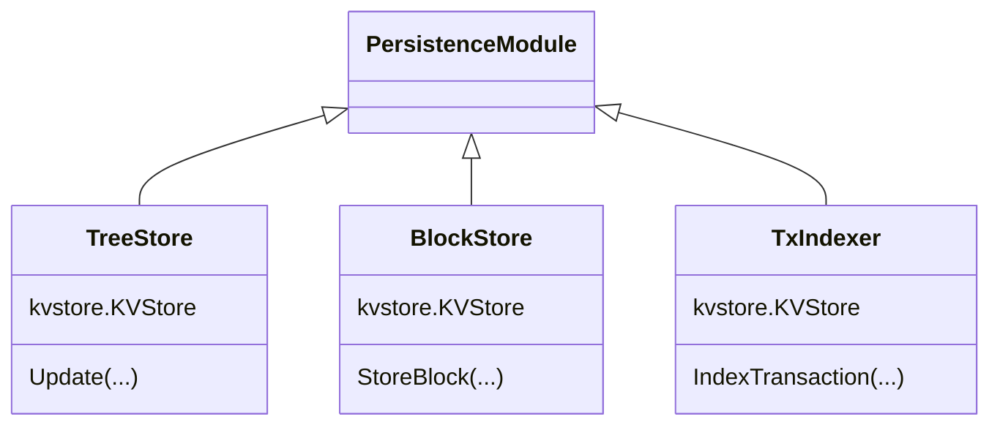

# ADR - Remove TxIndexer Submodule

* Status: Draft
* Deciders: @olshansk, @dylanlott, @h5law
* Date: 5 July 2023

## Technical Story

In the course of determining how to handle invalid transactions, it became clear the `TxIndexer` was an equal counterpart to the `TreeStore`, which contradicts prior statements about the `TreeStore` as being the "source of truth" for the peristence layer.

Instead, the `TxIndexer` acts like second data source and invalid entries between the two is possible in both directions. Invalid transactions can be peristed in Postgres and invalid Postgres data can be persisted in transactions.

Part of this work concerns the ongoing savepoints and rollbacks work in that transactions must be inserted first into Postgres and are then _read out_ by the `TreeStore`, meaning that in reality the `TreeStore` is not the source of truth, the PostgreSQL database is by nature of it being possible for data to exist in the database but not in the `KVStores` and vice versa. It should be noted the savepoints and rollbacks work can be completed without this refactor, as detailed in option 2.

## Context and Problem Statement

There is an impedance mismatch between the various submodules of the persistence module and its callers. The unit of work package wants to use an atomic interface, but the current interface presented by the `TreeStore`, `BlockStore`, and `TxIndexer` are not exposed as atomic. Instead, the block application process should be atomic from the perspective of the unit of work. The unit of work should be responsible for calling the `PersistenceRWContext` methods correctly. The `TreeStore` should be the source o truth for the `BlockStore`, the `TxIndexer`, and the `PersistenceRWContext`



## Decision Drivers

* Commits to the peristence layer are not easy to follow.
* The TreeStore is not treated as the actual source of truth.

## Considered Options

* Option 1: Remove the TxIndexer entirely and build it as part of the TreeStore
* Option 2: Update the TxIndexer to be atomically applied like the other data stores.
* Option 3: Do nothing

## Decision Outcome

*To be determined.*

### Positive Consequences

*To be determined.*

### Negative Consequences

*To be determined.*

## Pros and Cons of the Options

### Option 1: Remove TxIndexer Submodule

Leveraging some of the features gained by the recent switch to using [Pocket's SMT fork](https://pkg.go.dev/github.com/pokt-network/smt), the `TreeStore` can present an efficient interface for membership proofs, exclusion proofs, and can fulfill the transaction indexing functionality while reducing the complexity necessary to manage updates to the trees in the `TreeStore`.

It turns the three step persistence application process into a two step process, and ensures that the primary source of truth is the `TreeStore` and that the `Postgres` store reflects the committed view of the underlying `TreeStore` and not the other way around.

* Good, because it removes a submodule, thus decreasing the surface area and making the TreeStore a [deep module](https://csruiliu.github.io/blog/20201218-a-philosophy-of-software-design-II/).
* Good, because it simplifies the handling of atomic applications by making it clear that rollbacks are the caller's responsibility

### Option 2: Update Only HandleTransaction Behavior

In this option, the `TreeStore` would expose a new proving function that the `HandleTransaction` function would call before

* Good, because it's the fastest way to introduce a simple change that would result in a marked improvement in transaction handling and persistence safety.
* Bad, because it's addressing the symptom not the design problem.

### Option 3: Do Nothing

Doing nothing and continuing business as usual is always an option. In this case, we would move on right now, considering this not worth the time to properly refactor because we already have baked-in atomic transaction handling that is _Good Enough_ ©️ as it curerntly stands with savepoints and rollbacks with the TreeStore.

* Good, because we get on to the next thing.

- Bad, because it means more confusing transaction handling.

## Links & References

* [Notes on A Philosophy of Software Design - Deep Modules](https://csruiliu.github.io/blog/20201218-a-philosophy-of-software-design-II/)
* [Pocket's SMT fork](https://pkg.go.dev/github.com/pokt-network/smt)

## Appendix

### Fig. 1  - ComputeStateHash

Below is the current state of the function that updates the TreeStore. It passes the tree store a TxIndexer and updates the TreeStore for the given height. The problem is this function isn't clear about how the transactions get loaded into the state trees, and it clearly highlights the dependency on the Postgres transaction `p.tx` in order to carry out these updates.

```go
func (p *PostgresContext) ComputeStateHash() (string, error) {
 stateHash, err := p.stateTrees.Update(p.tx, uint64(p.Height))
 if err != nil {
  return "", err
 }
 p.stateHash = stateHash
 return p.stateHash, nil
}
```

### Fig. 2 - HandleTransaction Updates

```go
// HandleTransaction implements the exposed functionality of the shared utilityModule interface.
func (u *utilityModule) HandleTransaction(txProtoBytes []byte) error {
 txHash := coreTypes.TxHash(txProtoBytes)

 // Is the tx already in the mempool (in memory)?
 if u.mempool.Contains(txHash) {
  return coreTypes.ErrDuplicateTransaction()
 }
-       // Is the tx already committed & indexed (on disk)?
-       if txExists, err := u.GetBus().GetPersistenceModule().TransactionExists(txHash); err != nil {
-               return err
-       } else if txExists {
-               return coreTypes.ErrTransactionAlreadyCommitted()
-       }
+       // Is the tx included in the Transactions state tree?
+       root, nodeStore := u.GetBus().GetTreeStore().GetTree(trees.TransactionTreeName)
+       lazy := smt.ImportSparseMerkleTree(nodeStore, sha256.New(), root)
+        proof, err := lazy.Prove(txHash)
+        if err != nil {
+                return err
+        }
+        txHashBz, err := hex.DecodeString(txHash)
+        if err != nil {
+                return err
+        }
+        if valid := smt.VerifyProof(proof, root, txHashBz, txProtoBytes, lazy.Spec()); valid {
+                return coreTypes.ErrTransactionAlreadyCommitted()
+        }
+        // Validate the Transactions tree was used to calculate the root hash
+        stateHash, nodeStore := u.GetBus().GetTreeStore().GetTree(trees.RootTreeName)
+       lazy := smt.ImportSparseMerkleTree(nodeStore, sha256.New(), root)
+        proof, err := lazy.Prove([]byte(trees.TransactionsTreeName))
+        if err != nil {
+                return err
+        }
+        if valid := smt.VerifyProof(proof, stateHash, []byte(trees.TransactionsTreeName), root, lazy.Spec()); valid {
+                return errors.New("malicious transactions tree provided - not part of previous state hash")
+        }

        // Can the tx be decoded?
        tx := &coreTypes.Transaction{}
@@ -20,6 +38,7 @@ func (u *utilityModule) HandleTransaction(txProtoBytes []byte) error {
                return coreTypes.ErrProtoUnmarshal(err)
        }
        // Does the tx pass basic validation?
 if err := tx.ValidateBasic(); err != nil {
  return err
 }

 // Store the tx in the mempool
 return u.mempool.AddTx(txProtoBytes)
}
```
