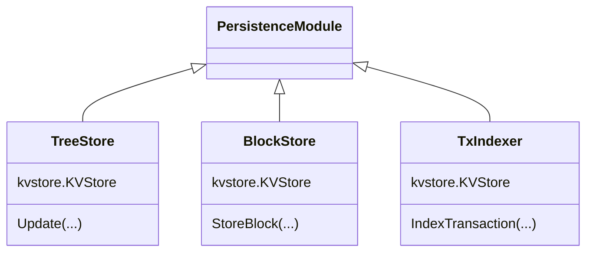
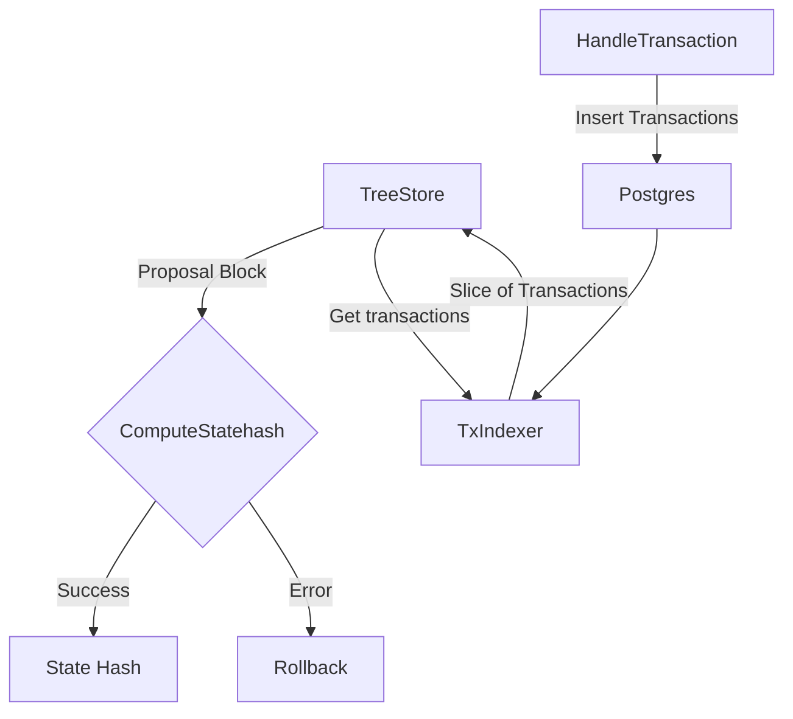
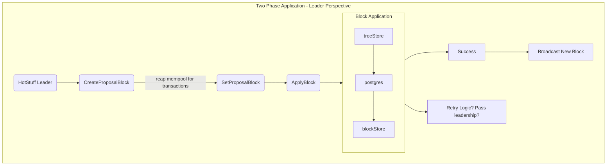
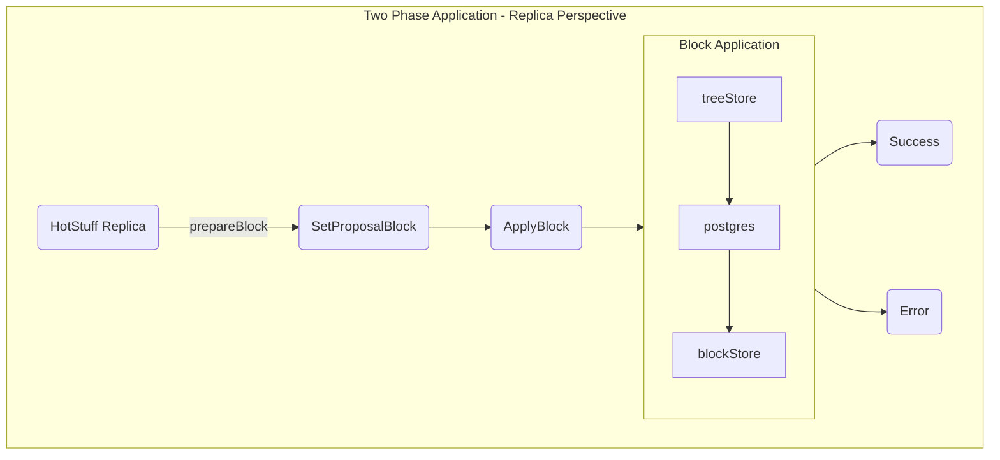
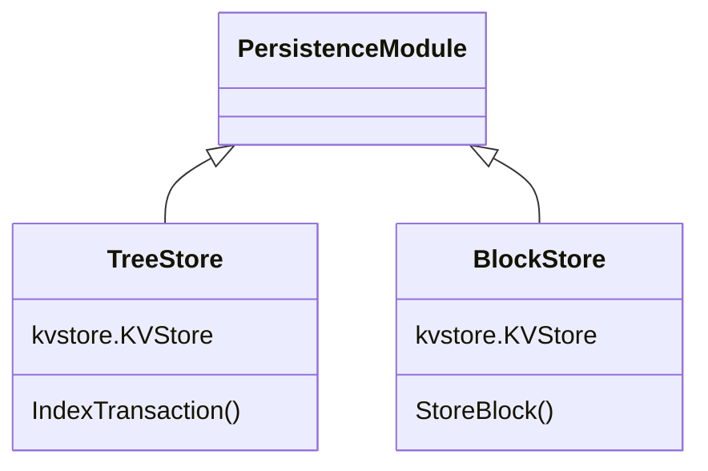

# ADR - Remove TxIndexer Submodule

* Status: Draft
* Deciders: @olshansk, @dylanlott, @h5law
* Date: 5 July 2023

## Technical Story

In the course of determining how to handle invalid transactions, it became clear the `TxIndexer` was an equal counterpart to the `TreeStore`, which contradicts prior statements about the `TreeStore` as being the "source of truth" for the peristence layer.

Instead, the `TxIndexer` mirror the Postgres database by its reliance on SQL queries to update its trees, allowin invalid entries between the two is possible in both directions. Invalid transactions can be persisted in Postgres, and invalid Postgres data can be persisted in transactions. Part of the savepionts and rollbacks work was to address this discrepancy, and to a large degree it has, but we could eliminate additional possible issues if we simplified the design.

Part of this work concerns the ongoing savepoints and rollbacks work in that transactions must be inserted first into Postgres and are then _read out_ by the `TreeStore`, meaning that in reality the `TreeStore` is not the source of truth, the PostgreSQL database is by nature of it being possible for data to exist in the database but not in the `KVStores` and vice versa. It should be noted the savepoints and rollbacks work can be completed without this refactor, as detailed in Option 2.

## Context and Problem Statement

There is an impedance mismatch between the various submodules of the persistence module and its callers. The unit of work package wants to use an atomic interface, but the current interface presented by the `TreeStore`, `BlockStore`, and `TxIndexer` are not exposed as atomic. Instead, the block application process should be atomic from the perspective of the unit of work. The unit of work should be responsible for calling the `PersistenceRWContext` methods correctly.

### Persistence Submodule Interfaces



The persistence submodules act like and are treated as peers, but the TreeStore is described as the source of truth.

### Proposal Block Creation & Application

Current block application process looks like this:



Block application happens from either the leader perspective or replica perspective. The block application process is similar for both of them, mainly differing in how the proposal block is set. The TxIndexer is key in the leader's block proposal flow, being called indirectly during the HandleTransaction process.





## Decision Drivers

**Big decision**: direction of data flow

The flow of data is currently non-linear in the persistence layer. There is a substantial and asynchronous indirection between the PostgreSQL layer, the TxIndexer, and the BlockStore. During creation of the next proposal block, the transactions are pulled from the TxIndexer, but then at a later time, in a different place, they are queried from the indexer to update the Merkle trees.

**Mid decision**: architecture of components

The TxIndexer is currently used by the `ipc`, `rpc`, and `trees` packages.

**Small decision**: implementation details

### The Direction of Data Flow

Postgres 💾 ← 👀 →  Trees 🌲

The cases where PostgreSQL is decoupled from the TreeStore are as follows.

1. Postgres is ahead of tree during block validation / application (ephemeral) 🟢 *By design*
   1. Intentionally done by design
   2. Postgres validates epehermal block → tree store → consensus → commit
2. Faults & rollbacks with a lack of atomicity 🟢 *Solved*
3. Every validator manually modifies their postgres DB 🟡 *Pending*
   1. Something invalid (based on trees) is validated everyone
   2. Postgres approved → trees rejected → consensus achieved → ❓❓❓❓

As noted above, the third case is the last case where there is uncertain handling. In the worst case, a transaction rejected by the trees but accepted by Postgres could potentially make it into the chain. The third case presents a situation where a popular validator shares a PostgreSQL database that has a corrupt transaction that does not exist in the TreeStore. This creates situations where account values could be updated without an associated transaction.

## Considered Options

* Option 1: Remove the TxIndexer submodule entirely and nest it as part of the TreeStore.
* Option 2: Update only the HandleTransaction functionality.
* Option 3: Do nothing.

## Decision Outcome

*To be determined.*

### Positive Consequences

*To be determined.*

### Negative Consequences

*To be determined.*

## Pros and Cons of the Options

### Option 1: Remove TxIndexer Submodule

Leveraging some of the features gained by the recent switch to using [Pocket's SMT fork](https://pkg.go.dev/github.com/pokt-network/smt), the `TreeStore` can present an efficient interface for membership proofs, exclusion proofs, and can fulfill the transaction indexing functionality while reducing the complexity necessary to manage updates to the trees in the `TreeStore`. This is a more involved solution than Option 2, but represents one possible conclusion to the decision made in Option 2: Providing a HandleTransaction function that would update the trees and index the transaction, allowing for savepoints and rollbacks to be managed by the `TreeStore` and essentially nesting the current `TxIndexer` under the TreeStore's responsibility. This reduces the number of submodules but at the cost of increasing the amount of complexity that the `TreeStore` handles.

It reduces the number of components in the block application process, and ensures that the primary source of truth is the `TreeStore`. `Postgres` reflects only the committed view of the `TreeStore` and not the other way around.



The `rpc`, `ibc`, `trees` packages currently rely on the TxIndexer. This would remove the `trees` dependency on the transaction indexer and assuming the responsibility of maintaining transaction indices. The `rpc` and `ibc` packages would then reference the `TreeStore` when querying for transactions.

* Good, because it removes a submodule, decreasing the surface area and thus complexity by making the TreeStore a [deeper module](https://csruiliu.github.io/blog/20201218-a-philosophy-of-software-design-II/).
* Good, because it simplifies the handling of atomic applications by making it clear that rollbacks are the caller's responsibility.
* Bad, because it increases the complexity of the TreeStore.
* Bad, because it is more effort than other options.

### Option 2: Update Only HandleTransaction Behavior

In this option, the `TreeStore` would expose a new proving function that the `HandleTransaction` function would call.

#### HandleTransaction Updates

From @h5law's spike on what the handle transaction updates would require:

```go
// HandleTransaction implements the exposed functionality of the shared utilityModule interface.
func (u *utilityModule) HandleTransaction(txProtoBytes []byte) error {
    txHash := coreTypes.TxHash(txProtoBytes)

    // Is the tx already in the mempool (in memory)?
    if u.mempool.Contains(txHash) {
        return coreTypes.ErrDuplicateTransaction()
    }
-   // Is the tx already committed & indexed (on disk)?
-   if txExists, err := u.GetBus().GetPersistenceModule().TransactionExists(txHash); err != nil {
-           return err
-   } else if txExists {
-           return coreTypes.ErrTransactionAlreadyCommitted()
-   }
+   // Is the tx included in the Transactions state tree?
+   root, nodeStore := u.GetBus().GetTreeStore().GetTree(trees.TransactionTreeName)
+   lazy := smt.ImportSparseMerkleTree(nodeStore, sha256.New(), root)
+   proof, err := lazy.Prove(txHash)
+   if err != nil {
+           return err
+   }
+   txHashBz, err := hex.DecodeString(txHash)
+   if err != nil {
+           return err
+   }
+   if valid := smt.VerifyProof(proof, root, txHashBz, txProtoBytes, lazy.Spec()); valid {
+           return coreTypes.ErrTransactionAlreadyCommitted()
+   }
+   // Validate the Transactions tree was used to calculate the root hash
+   stateHash, nodeStore := u.GetBus().GetTreeStore().GetTree(trees.RootTreeName)
+   lazy := smt.ImportSparseMerkleTree(nodeStore, sha256.New(), root)
+   proof, err := lazy.Prove([]byte(trees.TransactionsTreeName))
+   if err != nil {
+           return err
+   }
+   if valid := smt.VerifyProof(proof, stateHash, []byte(trees.TransactionsTreeName), root, lazy.Spec()); valid {
+           return errors.New("malicious transactions tree provided - not part of previous state hash")
+   }

        // Can the tx be decoded?
        tx := &coreTypes.Transaction{}
@@ -20,6 +38,7 @@ func (u *utilityModule) HandleTransaction(txProtoBytes []byte) error {
                return coreTypes.ErrProtoUnmarshal(err)
        }
        // Does the tx pass basic validation?
        if err := tx.ValidateBasic(); err != nil {
            return err
        }

        // Store the tx in the mempool
        return u.mempool.AddTx(txProtoBytes)
}
```

* Good, because it's the fastest way to introduce a simple change that would result in a marked improvement in transaction handling and persistence safety.
* Bad, because it's addressing the symptom not the design problem.

### Option 3: Do Nothing

Continuing with the current approach without making any changes is another option. This means moving forward without investing additional time into a comprehensive refactor. It's worth considering this option as the current implementation already includes atomic transaction handling through savepoints and rollbacks with the TreeStore.

* Good, because we get on to the next thing.
* Bad, because it means more confusing transaction handling.

## Links & References

* [Notes on A Philosophy of Software Design - Deep Modules](https://csruiliu.github.io/blog/20201218-a-philosophy-of-software-design-II/)
* [Pocket's SMT fork](https://pkg.go.dev/github.com/pokt-network/smt)
* [Address the discrepancy between the state trees and txIndexer #875](https://github.com/pokt-network/pocket/issues/875)
