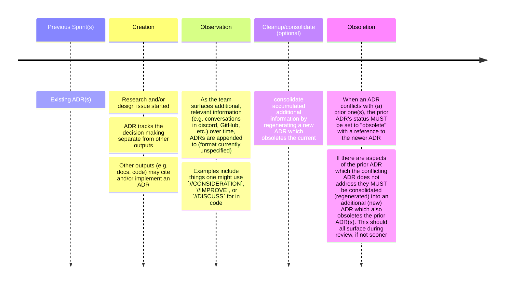
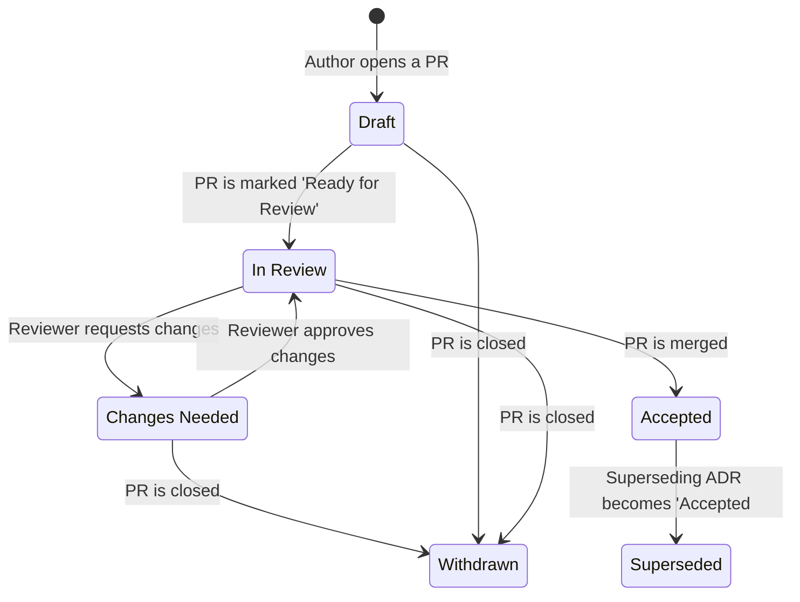

# Architecture Decision Records (ADRs)

This repository contains a collection of Architecture Decision Records (ADRs) that document important decisions made during the development of our project.
ADRs help us maintain a historical record of our design choices, making it easier for both current and future team members to understand the rationale behind those decisions.

## What is an Architecture Decision Record?

An Architecture Decision Record (ADR) is a concise document that captures a single decision and its context, including the problem statement, decision drivers, considered options, and the chosen solution.
ADRs provide a way to communicate and preserve architectural decisions in a structured format, ensuring that the decision-making process remains transparent and easy to follow.

## How are we using ADRs?

We use ADRs to document significant design choices that impact the overall architecture of our system.
These decisions may include, but are not limited to:

- Selection of technologies or libraries
- Changes in data models or schemas
- Design patterns or architectural styles
- Adoption of new processes or methodologies

We aim to create ADRs as early as possible in the decision-making process, allowing for review and discussion by the entire team.
ADRs are then committed to this repository, providing a historical record of our architectural decisions.

## Using LLMs for ADR Generation and Refinement

In addition to the conventional (i.e. manual) method, we are also experimenting with using large language models, such as OpenAI's GPT, to generate and refine ADR documents.
These prompts are included in the ADRs directory which can help automate the process of creating ADRs, while still ensuring that the content is relevant and accurate.

To use the large language models for ADR generation, simply provide the necessary context and problem statement as input to the model, and it will generate a draft ADR based on the given information.
The generated ADR can then be reviewed and refined by the team members to ensure its accuracy and completeness.

## Workflow

## Document status flowchart

## Contributing

To contribute a new ADR, please follow these steps:

1. Create a new branch for your ADR.
2. Copy the ADR template from `ADR_TEMPLATE.md` and create a new file with the next ADR number and title as an [imperative mood verb phrase](https://en.wikipedia.org/wiki/Imperative_mood) (e.g., `0003-adopt-multiaddr.md`).
3. Fill in the necessary information in the new ADR file, following the template structure.
4. Use the large language model prompts, if desired, to generate or refine the ADR content.
5. Submit a pull request to merge your ADR branch into the main branch, including a brief description of the problem and solution.
6. Add a reference to the [ADR Index](https://www.notion.so/pocketnetwork/1a5893d2183b470b93610d2d9ce84d36?v=91b83d5b44d34ba6abf36f9070c2f3a8&pvs=4) for your pull request with appropriate status.
7. Request a review from the team members, and address any feedback or suggestions provided.
8. Once approved, merge the pull request to update the repository with the new ADR.
9. If rejected or withdrawn, update the document's status as withdrawn, close the pull request, and update the status of the ADR in the [ADR Index](https://www.notion.so/pocketnetwork/1a5893d2183b470b93610d2d9ce84d36?v=91b83d5b44d34ba6abf36f9070c2f3a8&pvs=4).

## Links

- [ADR GitHub org](https://adr.github.io/)
- [Markdown Any Decision Records](https://adr.github.io/madr/)
- [ADR Explainer & Examples](https://github.com/joelparkerhenderson/architecture-decision-record)
- [ADR Manager Web UI](https://github.com/adr/adr-manager) (**[live](https://adr.github.io/adr-manager/#/)**)
- [Planguage - Specifying Non-Functional Requirements](https://www.iaria.org/conferences2012/filesICCGI12/Tutorial%20Specifying%20Effective%20Non-func.pdf)