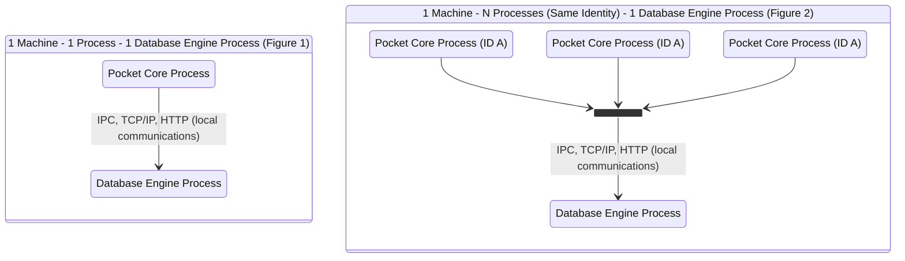
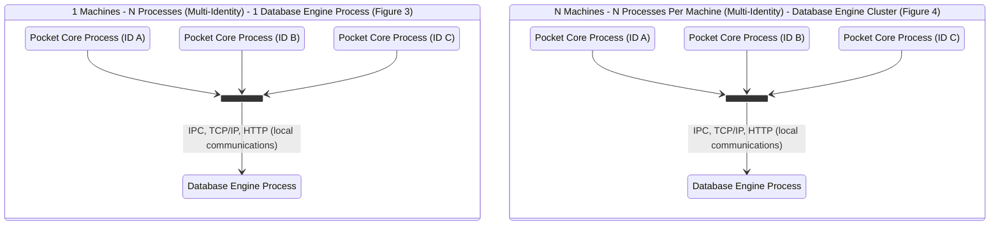
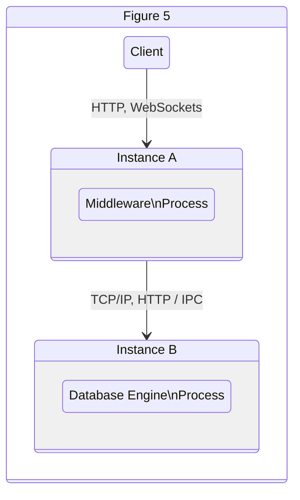
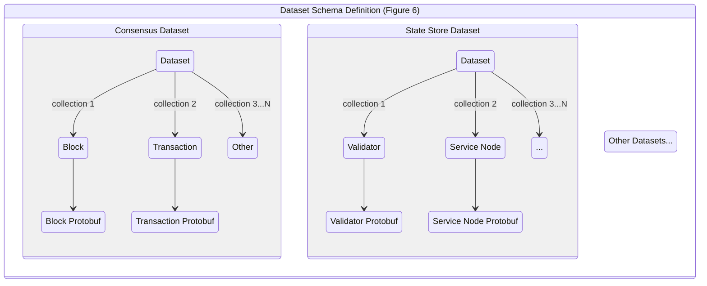
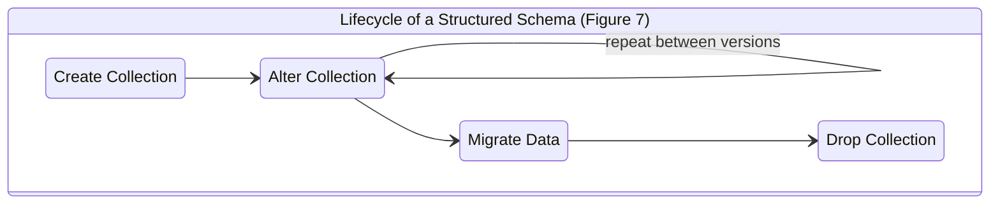
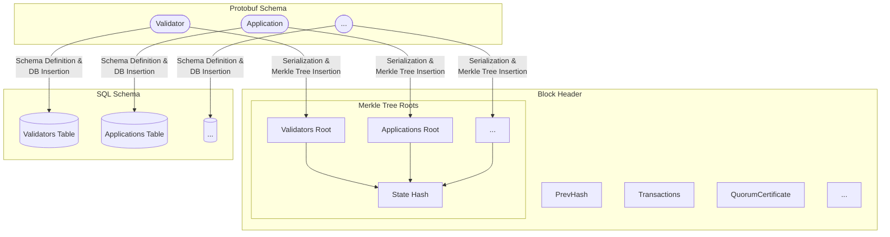
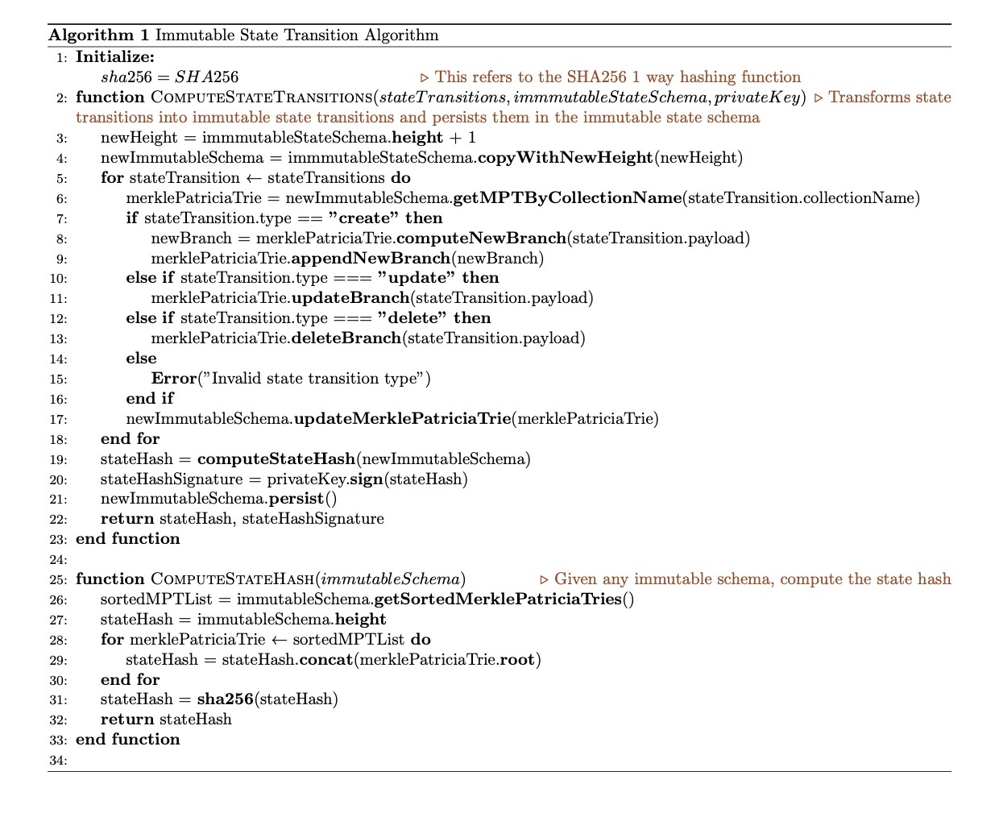
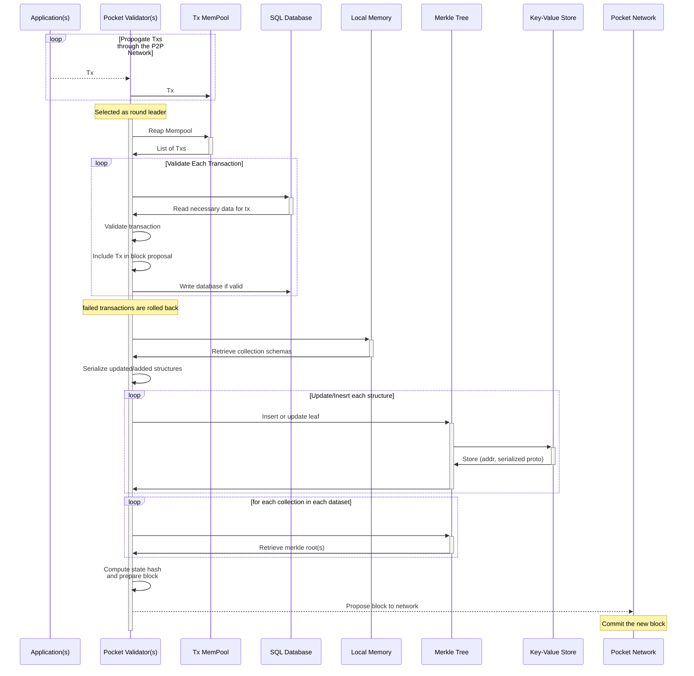

# Pocket Network 1.0 Persistence Module Specification: Tamper Proof Hybrid Mutable Database Persistence Model <!-- omit in toc -->

<p align="center">
    @luyzdeleon - Luis Correa de León<br>
    @olshansk - Daniel Olshansky<br>
    Version 1.0.3 - July 2022
</p>

- [Abstract](#abstract)
- [1. Introduction](#1-introduction)
- [2. Requirements](#2-requirements)
- [3. Client-Server Architecture](#3-client-server-architecture)
  - [3.1 Overview](#31-overview)
  - [3.2 Database Engine](#32-database-engine)
    - [3.2.1 Configuration](#321-configuration)
  - [3.3 Error Handling](#33-error-handling)
    - [3.3.1 Database Engine Error Handling](#331-database-engine-error-handling)
    - [3.3.2 Middleware Error Handling](#332-middleware-error-handling)
- [4. Persistence Client Middleware](#4-persistence-client-middleware)
  - [4.1 Overview](#41-overview)
  - [4.2 Persistence Datasets](#42-persistence-datasets)
    - [4.2.1 Datasets Schema Definition](#421-datasets-schema-definition)
    - [4.2.2 Datasets Schema Migration](#422-datasets-schema-migration)
    - [4.2.3 State Versions De-duplication Strategy](#423-state-versions-de-duplication-strategy)
      - [4.2.4 Idempotent Writes and Updates](#424-idempotent-writes-and-updates)
  - [4.2.5 Deterministic Write mechanism](#425-deterministic-write-mechanism)
- [5. Blockchain State Validation Architecture](#5-blockchain-state-validation-architecture)
  - [5.1. Overview](#51-overview)
  - [5.2 State Hash](#52-state-hash)
    - [5.2.1 State Hash Computation](#521-state-hash-computation)
    - [5.2.2 Immutable State Hash](#522-immutable-state-hash)
  - [5.3 Key-Value Store](#53-key-value-store)
    - [5.3.1 Data Encoding](#531-data-encoding)
  - [5.4 Cumulative Versioning](#54-cumulative-versioning)
  - [5.5 State Verification](#55-state-verification)
  - [5.6 State Transition](#56-state-transition)
    - [5.6.1 State Transition Algorithm](#561-state-transition-algorithm)
    - [5.6.2 State Transition Sequence Diagram](#562-state-transition-sequence-diagram)
- [Dissenting Opinions / Attack Vectors / FAQ](#dissenting-opinions--attack-vectors--faq)
  - [<span style="text-decoration:underline;">1. Why not just store the state in a tree like every other blockchain?</span>](#1-why-not-just-store-the-state-in-a-tree-like-every-other-blockchain)
  - [<span style="text-decoration:underline;">2. Can an attacker just modify the mutable database and make a node commit to an invalid state?</span>](#2-can-an-attacker-just-modify-the-mutable-database-and-make-a-node-commit-to-an-invalid-state)
  - [<span style="text-decoration:underline;">3. Isn’t this approach more susceptible to errors as there are more moving parts?</span>](#3-isnt-this-approach-more-susceptible-to-errors-as-there-are-more-moving-parts)
- [Candidate Features / Would Like to Haves / Open Questions](#candidate-features--would-like-to-haves--open-questions)
  - [<span style="text-decoration:underline;">1. What Kind of Merkle Tree is going to be used?</span>](#1-what-kind-of-merkle-tree-is-going-to-be-used)
  - [<span style="text-decoration:underline;">2. What Kind of Key-Value store database engine is going to back the Merkle Tree?</span>](#2-what-kind-of-key-value-store-database-engine-is-going-to-back-the-merkle-tree)
  - [<span style="text-decoration:underline;">3. How will light clients store data?</span>](#3-how-will-light-clients-store-data)
  - [<span style="text-decoration:underline;">4. Add a key/value store for caching data alongside a relational database that does not hinder performance and avoids too much data duplication.</span>](#4-add-a-keyvalue-store-for-caching-data-alongside-a-relational-database-that-does-not-hinder-performance-and-avoids-too-much-data-duplication)
- [References](#references)
- [Spec Coverage Checklist](#spec-coverage-checklist)

# Abstract

This document presents a specification for the Persistence Module of Pocket Network 1.0, which aims to tackle the persistence needs of Pocket Network 1.0 nodes: scalability, robustness, data integrity and security. This specification is composed of 3 pillars:

1. A **Client-Server Architecture** separating middleware processes from a generic database engine where the persistent data lives.
2. A **Persistence Client Middleware Specification** dictating how clients of the generic database engine behave to persist, update and query the datasets necessary for participating as Pocket Network actors.
3. A **Blockchain State Validation Architecture** fulfilling the tamper-proof requirements of blockchain databases allowing nodes to achieve consensus after every persistence dataset migration.

# 1. Introduction

Historically, blockchain clients have been developed with a focus on two use cases: **Validators** and **Full Nodes**. **Validators** are network actors who, given a particular condition indicated by the consensus protocol, get to propose and commit a block with transactions to the blockchain state. **Full Nodes**, on the other hand, validate and maintain copies of the state to be accessed by applications that want to query or transact with the blockchain.

However, even though Full Nodes are mission-critical infrastructure components for application development, they are still seen as _second-class citizens_ relative to Validators in terms of their importance. For this reason, various centralized blockchain infrastructure providers had to develop production paradigms such as [Alchemy's Supernode Architecture](https://www.alchemy.com/supernode) or [Infura's Cloud Architecture](https://blog.infura.io/building-better-ethereum-infrastructure-48e76c94724b/), highlighting the limitations of Blockchain Clients as production-grade infrastructure.

<!-- FutureIteration(olshansky):
  1. Background
  2.1 Light Clients
  2.2 Merkle Trees
  2.3 Key-Value Stores
  2.4 Use of SQL in Blockchains-->

# 2. Requirements

| Requirement                                                                                                                                                       | Pillar                                      |
| ----------------------------------------------------------------------------------------------------------------------------------------------------------------- | ------------------------------------------- |
| **Transaction Isolation**: Persistent data can be backed up and restored across different node operations.                                                        | Client-Server Architecture                  |
| **Portability**: It is possible to provide different implementations of the interface and database engine layers adhering to the same interface.                  | Client-Server Architecture                  |
| **Individual Scalability**: The middleware can be scaled independently from the database engine.                                                                  | Client-Server Architecture                  |
| **Fault Tolerance**: Failures can be isolated between the middleware and database engine.                                                                         | Client-Server Architecture                  |
| **Multi-Process Concurrency**: Multiple processes can access the database engine concurrently.                                                                    | Client-Server Architecture                  |
| **State Dataset Versioning**: Every version of the `Blockchain State` dataset must be versioned.                                                                  | Persistence Client Middleware specification |
| **"Byte-perfect consistency" data encoding**: Data is encoded in a format that allows for byte-perfect equality checks.                                           | Persistence Client Middleware specification |
| **Schema Definition Mechanism**: Dataset structures must be schematized and schema changes are only allowed between different versions of the dataset.            | Persistence Client Middleware specification |
| **Deterministic Write Mechanism**: Faulty writes that compromise the integrity of the state can be rolled back.                                                   | Persistence Client Middleware specification |
| **Idempotent Dataset Updates**: The same update operation to a dataset, applied multiple times, must yield the same dataset state.                                | Persistence Client Middleware specification |
| **Verifiable State Hash**: It is possible to compute a single authenticator that validates the integrity of the entire state.                                     | Blockchain State Validation architecture    |
| **Cumulative State Versioning**: Each new version of the state must be cumulative by only adding deltas of the state change without recomputing the entire state. | Blockchain State Validation architecture    |
| **Dataset Integrity Verification**: It is easy to verify if a particular element belongs to a particular version of a specific state dataset.                     | Blockchain State Validation architecture    |

# 3. Client-Server Architecture

## 3.1 Overview

In the context of the Persistence Module, a **client-server architecture** indicates a separation of concerns between the **middleware** and the **database engine**. In practice, this allows for multiple types of system deployments illustrated in Figures 1-4.





## 3.2 Database Engine

The selected **Database Engine** for Pocket, which will often be referred to as “**the database engine**”, is [PostgreSQL](https://www.postgresql.org/). The accompanying [research document](./RESEARCH.md) to this Pre-Planning Specification contains the research through which this decision was made. In addition, PostgreSQL has multiple desirable properties that satisfy requirements such as **Schema Definition Mechanism**, **Deterministic Write Mechanism** and **Idempotent Dataset Updates**.

### 3.2.1 Configuration

Several approaches can be used to configure communication between the middleware and the database engine. The following is a data structure that contains the necessary attributes:

```
type DBConfiguration interface {
	Host() URL           # host url where to contact the database engine (e.g. 1.2.3.4, localhost)
	Username() String    # the username used by the middleware to access the database engine
	Password() String    # the password used by the middleware to access the database engine
}
```

On the database engine, the following configurations needs to be specified:

1. **User role**: 1 of **Servicer**, **Validator**, **Fisherman**, **Archival** or **Full Node**.
2. **Schemas**: 1 or more of **Consensus**, **State**, **Block** **Mempool** and **Local**.

These configurations will be referenced throughout this specification to satisfy requirements and complement other mechanisms at different module layers.

## 3.3 Error Handling

Due to the separation of concerns between the middleware and the database engine, an error handling architecture at the system deployment level must be established to allow fault tolerance strategies in the execution of the system.

### 3.3.1 Database Engine Error Handling

There are 3 main use cases of error handling when the database engine is the source of the error:

1. **Configuration Errors**: In the case of configuration errors, the middleware must propagate errors from database engine and surface them via logs or other system-wide notifications. This is a **critical** error and must stop the execution of the system until resolved.
2. **Read/Write Errors** or **Database Engine Unavailable**: If any of these errors are returned by the database engine, the middleware can opt into one of the following fallback mechanisms:
   - Provision a temporary in-memory database
   - Retry the operation on another replica
   - Queue the operation and retry once the database engine is restored
   - In addition to these fallback mechanisms, the middleware must surface the issue via logs or other system-wide notifications. This is a **critical** error and must stop the execution of the system until resolved unless a fallback mechanism is configured.

### 3.3.2 Middleware Error Handling

The database engine should be configured to handle the following middleware error scenarios:

1. **Invalid data format writes**: If the middleware is trying to write data using unsupported formats, the database engine must be equipped to reject these requests with a valid error message that are surfaced by the middleware client via logs or other system-wide notifications.
2. **Long-running queries**: All queries to the database engine must be capped to a maximum query timeout and a maximum data output. These must be set at the database engine level configured in case the middleware is to request a query that goes out of bounds. In addition, the database engine must be equipped to reject these requests with a valid error message to be surfaced by the middleware client via logs or other system-wide notifications.

# 4. Persistence Client Middleware

## 4.1 Overview

In the context of the Persistence Module, the **middleware** is the software that sits between the **client** and the **database engine**, hence “in the middle” as shown the in the Figure 5.



In order to ensure all the requirements described in this document are met, a set of expected behaviours and attributes the middleware is responsible for will need to be defined.

## 4.2 Persistence Datasets

A **dataset** is a group of collections that is logically related. For Pocket Network 1.0, we are proposing the following datasets:

1. **Consensus dataset**: Contains all the transactions, blocks and quorum certificates of the Pocket Network blockchain. Validators need this data set to achieve Byzantine agreement and for other nodes to verify Byzantine Fault Tolerance.
2. **State dataset**: Contains the specific Pocket Network state (nodes, apps, params, accounts, etc) for a particular height. A hashed version of the state dataset is called the **state hash**.
3. **Block store dataset**: A collection of (state dataset, state hash) pairs for every block height stored on the node.
4. **Mempool dataset**: Contains a list of all transactions submitted to the Pocket Network but not yet finalized on the blockchain. This dataset is populated through messages gossiped throughout the network and is transient in nature.
5. **Local dataset**: Contains all the utility-specific data needed for the different actors of the network to achieve their functions. This dataset is local and only affects an individual node's operation.

Each dataset can be individually accessed by a particular middleware instance, which allows reusability of the data via operations in a multi-node and multi-process environment.

### 4.2.1 Datasets Schema Definition

There is a one-to-many relationship between a dataset and a set of **collections**, with a one-to-one relationship between each collection and its **structured schema**.

[Section 5](#5-blockchain-state-validation-architecture) defines details related to data encoding, but assume that [Protocol Buffers](https://developers.google.com/protocol-buffers) are used for the sake of the visualization in Figure 6.



### 4.2.2 Datasets Schema Migration

Since Pocket Network 1.0 is designed to be build atop a SQL database engine, the schema can be modified using a **migration paradigm**. Migrations are a series of phases in a structure schema lifecycle, as shown in Figure 6.



Migrations will be tied to specific heights, ensuring that nodes across different state heights (e.g. during state sync) can independently reproduce and verify a local **state schema** at a particular height. This enables each node to produce the immutability proofs included in the blocks, which will be checked against the block hashes during validation.

### 4.2.3 State Versions De-duplication Strategy

Given the fact that the selected database engine describes collections in a **tabular schema** and that the **state dataset** has to be versioned on every change, a de-duplication strategy is needed to avoid data redundancy and decrease lookup and scan overhead when operating against any given **state collection**. For this reason, we are proposing the following field in every state collection:

- **Height (height):** Indicates the height at which the structure is **added to the dataset.**

By leveraging this single property, we can define the **Create**, **Update** and **Delete** operations of the [CRUD](https://en.wikipedia.org/wiki/Create,_read,_update_and_delete) set:

- **Create**: Insert a new structure into the collection with the given **height** value indicating at which height the structure is inserted.
- **Update**: Insert a new record of the updated structure with the given **height** value indicating at which height the structure is being updated (i.e. created).
- **Delete**: Though there is an opportunity to prune the data set for efficiency, once a structure (with an address) has been created, it can transition from one state to another but otherwise exists in perpetuity.

CRUD's **Read** operation naturally follows from the ability to query a SQL database. These attributes and processes allow us to fulfill the different requirements of a state dataset:

- **Historical querying**: Query the same structure throughout any given height by filtering by a specific **height** as a maximum.

#### 4.2.4 Idempotent Writes and Updates

To implement idempotency to our persistence layer, we need to define the following set of rules when doing **Create** or **Update** operations over collections and structures:

- When creating a brand new structure, the operation must include all of its uniquely-identified fields. This will help avoid collisions between existing and new structures.
- When updating an existing structure, all uniquely-identified fields must be indicated explicitly in the operation. Specifically, timestamp fields such as **height** must also be specified explicitly to avoid collisions and indecies at the SQL layer must created to avoid collision errors.

## 4.2.5 Deterministic Write mechanism

Most modern SQL DBMS (database management system) implementations utilize the **Transaction model** to indicate a transaction as a group of operations to be performed sequentially and logically grouped. This is called **[ACID]**(https://en.wikipedia.org/wiki/ACID) (atomicity, consistency, isolation, durability), which are the properties that allow the dataset to stay consistent across operations by enabling capabilities such as rollbacks in case one of the operations comprising an ACID transaction fails or yields an inconsistent dataset state.

Our chosen database engine, **Postgresql**, defines a transaction model in its official documentation [here](https://www.postgresql.org/docs/current/tutorial-transactions.html). It also defines the ability to rollback transactions [here](https://www.postgresql.org/docs/current/sql-rollback-prepared.html). These mechanisms establish the ability to achieve deterministic writes while avoiding issues such as data corruption and race conditions.

<!-- FutureIteration(olshansky): Dive into a deeper discussion of how multiple each "utility level transaction" can be decomposed into multiple DB transactions, each of which is atomic in itself. The middleware layer can aggregate them a priori into one DB transaction, OR, the DB engine can be leveraged via conflicts & upserts to immitiate this behaviour for a simpler implementation. In summary, all the utility level transactions, which may or may not have a 1:1 mapping to DB transactions, are applied atomically in the context of a single height.-->

# 5. Blockchain State Validation Architecture

## 5.1. Overview

The sections above describe the architecture and use of a SQL database engine to enable efficient and fault tolerant data access during various node operations. However, as in most other blockchains, we also need to efficiently compute and prove the integrity of the data.

Alongside the SQL engine operations described above for efficient data access during node operations, [Sprase Merkle Trees](https://ethresear.ch/t/optimizing-sparse-merkle-trees/3751) backed by key-value store data engines will be used to store a serialized version of the dataset in order to do so and achieve tamper-proof **immutability**.

## 5.2 State Hash

### 5.2.1 State Hash Computation

Recall that the **state dataset** contains the Pocket Network state (i.e. node, apps, params, accounts, etc) after each set of state transitions indicated by the transactions executed at a specific height. Each **collection** in the state dataset (e.g. Application) will have a corresponding **state schema** (e.g. Application protobuf definition) containing an **address**. Each of these collections will have it's own **Merkle Tree**, yielding a **Merkle Root**. In the tree, leaf nodes will be represent instances of objects in the collection, whereas inner nodesn act as prefix paths to the leaf based on the object's address. This is often known as an **Addressable Merkle Tree** in some blockchain projects.

The **state hash** is computed by concatenating, in lexicographical order, the Merkle Root of each collection and hashing the result.



### 5.2.2 Immutable State Hash

Each state hash will be persisted alongside a cryptographic digital signature computed via a designated private key (i.e. the block proposer during consensus), serving as proof for validation during local state computation. This proof will be utilized to avoid recalculating previous states and allow the system, provided trusted access to the public key, to have a high degree of confidence in its computed state. The state can be re-calculated using the state hash algorithm if the proof has been tampered with. This proof will be referred to as the **state computation proof.**

## 5.3 Key-Value Store

The Merkle Tree mentioned above will be backed by a key-value store database engine to persist the state dataset. In this tree, the key will the address, a mandatory field of each collection, and the value is a serialized version of that instance of the structure using the schema defined at that height.

### 5.3.1 Data Encoding

A generic and deterministic data encoding format is needed to encode each structure of each collection (i.e. each leaf of each tree) to compute the immutable state hash. Pocket Network v1 has selected [Protocol Buffers](https://developers.google.com/protocol-buffers), also known as **Protobufs**, for this task. As outlined in the accompanying [research document](./RESEARCH.md), Protobuf fulfills all the requirements and performance benchmarks for this implementation. Note that while Pocket Network V1.0 will use a standardized data encoding protocol, likely to be Protobuf, it does not exclude other protocols (e.g. [FlatBuffers](https://google.github.io/flatbuffers)) from being used in future major releases.

## 5.4 Cumulative Versioning

An attribute of most Addressable Sparse Merkle Trees is that every new operation for a given does not require the recomputation of the entire trie, rather only the **branch elements** that are being updated, satisfying our requirement of **Cumulative State Versioning**. This enables persisting deltas across versions of the immutable state schema rather than copies of the entire trie structure.

## 5.5 State Verification

To verify any given structure in one of the collections in the state dataset in a Merkle Patricia Trie, the prover (i.e. a full node) needs to only provide the Merkle proof to the verified (e.g. a client or synching node). The Merkle Proof will be composed of a list of (address, serialized protobuf structures), and it is assumed that the client has access to the corresponding merkle root and leaf being verified.

## 5.6 State Transition

To compute transitions of the **state dataset** to the **immutable schema**, we present an algorithm that, given a series of **state transitions**, the **current immutable schema** and a **private key** can compute the new **state hash** and the **state computation proof**. See Algorithm 1 as a reference.

### 5.6.1 State Transition Algorithm



<!-- NextIteration(olshansky): Update the diagram and add the latex source code-->

### 5.6.2 State Transition Sequence Diagram

Below is a sequence diagram showing the end-to-end data flow between the different components during a state transition.



# Dissenting Opinions / Attack Vectors / FAQ

## <span style="text-decoration:underline;">1. Why not just store the state in a tree like every other blockchain?</span>

Pocket Network's primary difference from most other blockchains is that it is an **application-specific blockchain** optimized to be a decentralized Web3 RPC middleware layer. Unlike smart contract blockchains, arbitrary data cannot be uploaded by the users, as that would break the immutable state schema based on predefined collections of structures.

However, this specification still provides a Blockchain State Validation architecture, which leverages Sparse Merkle Trees to create a tamper-proof representation of the blockchain state at any given height. This achieves the property of having immutable yet still upgradable schemas.

The only tradeoff concerns data replication of the immutable database schema, which can be solved via pruning and hashing of the tree.

## <span style="text-decoration:underline;">2. Can an attacker just modify the mutable database and make a node commit to an invalid state?</span>

This attack vector can still exist in persistence architectures built only on top of trees. However, this would break functionality when proof for the local state is computed by yielding an invalid state hash.

This would cause the node with an invalid state to fall out of state sync or consensus, and inherently start an unsupported fork.

## <span style="text-decoration:underline;">3. Isn’t this approach more susceptible to errors as there are more moving parts?</span>

The only additional step this architecture includes, relative to most blockchains, is computing the leaf nodes via operations on the mutable database. However, we believe that this is a valid tradeoff as it can be easily managed as a separate submodule of the persistence layer.

# Candidate Features / Would Like to Haves / Open Questions

## <span style="text-decoration:underline;">1. What Kind of Merkle Tree is going to be used?</span>

This is still an active area of research, and the specification will be updated once it is complete.

The use of [IAVL](https://github.com/cosmos/iavl) has been ruled out due to the inefficiencies learn from Pocket Network v0 after its adoption from Tendermint. Some potential alternatives include

- [Merkle Patricia Tries](https://ethereum.org/en/developers/docs/data-structures-and-encoding/patricia-merkle-trie/)
- [Urkle Trees](http://diyhpl.us/wiki/transcripts/stanford-blockchain-conference/2019/urkel-trees/)
- [Jellyfish Merkle Trees](https://developers.diem.com/papers/jellyfish-merkle-tree/2021-01-14.pdf)
- [Verkle Trees](https://math.mit.edu/research/highschool/primes/materials/2018/Kuszmaul.pdf)

## <span style="text-decoration:underline;">2. What Kind of Key-Value store database engine is going to back the Merkle Tree?</span>

This is still an active area of research, and the specification will be updated once it is complete. Some potential solutions include:

- [LevelDB](https://github.com/google/leveldb)
- [RocksDB](https://github.com/facebook/rocksdb)
- [BadgerDB](https://github.com/dgraph-io/badger)
- [BoltDB](https://github.com/boltdb/bolt)
- [hstore](https://www.postgresql.org/docs/current/hstore.html)

## <span style="text-decoration:underline;">3. How will light clients store data?</span>

As a decentralized RPC provider, light clients are a lower priority in the context of the Pocket Network. Optimizing the persistence layer of most protocol level actors today, which require a full but efficient datastore, is the goal of this specification until further revisions.

## <span style="text-decoration:underline;">4. Add a key/value store for caching data alongside a relational database that does not hinder performance and avoids too much data duplication.</span>

This optimization can be tackled in future versions of the specification. Specifically, building interfaces between the persistence module and other caching technologies such as [Redis](https://redis.io/) or [ElasticSearch](https://www.elastic.co/) are available.

# References

[1] [Persistence Spec Research Document](RESEARCH.md)

[2] [https://en.wikipedia.org/wiki/Create,\_read,\_update_and_delete](https://en.wikipedia.org/wiki/Create,_read,_update_and_delete)

[3] [https://en.wikipedia.org/wiki/ACID](https://en.wikipedia.org/wiki/ACID)

[4] [https://www.postgresql.org/docs/current/tutorial-transactions.html](https://www.postgresql.org/docs/current/tutorial-transactions.html)

[5] [https://developers.google.com/protocol-buffers](https://developers.google.com/protocol-buffers)

[6] [https://eth.wiki/fundamentals/rlp](https://eth.wiki/fundamentals/rlp)

# Spec Coverage Checklist

_NOTE: This is still a WIP and a non-exhaustive_

For those implementing the specification, below is a checklist that can be used as a reference to determine the spec coverage implementation.

3. Client-Server Architecture

- 3.2.1 Configuration
  - [ ] DB connection: host, username, password, etc..
  - [ ] User role: validator, servicer, fisherman, archival, full node
  - [ ] Schema definition: consensus, state, mempool, local
- 3.3.1 Database Engine Error Handling
  - [ ] Configuration errors: handle & propagate
  - [ ] Read/Write/Unavailable errors: handle & propagate
- 3.3.2 Middleware Error Handling
  - [ ] Invalid data format writes: handle & propagate
  - [ ] Long-running queries: handle & propagate

4. Persistence Client Middleware

- 4.2. Persistence datasets implemented
  - [ ] Consensus: blocks, transactions, quorum certifications, etc…
  - [ ] State: nodes, apps, params, accounts, etc…
  - [ ] Block: (state dataset, state hash) pairs
  - [ ] Mempool: transient until a block is finalized
  - [ ] Local: temporary local node data needed for operation
- 4.2.1 Persistence schema defined (Protobuf & SQL)
  - [ ] Consensus
    - [ ] Blocks
    - [ ] Transaction
    - [ ] Quorum Certificates
  - [ ] State
    - [ ] Nodes
    - [ ] Apps
    - [ ] Params
    - [ ] Accounts
  - [ ] Block; (State dataset, state hash) pairs

5. Blockchain State Validation Architecture

- 5.2.1
  - [ ] State Hash computation
  - [ ] Immutable State Hash computation (i.e. signing)
  - [ ] Merkle Tree selection & implementation
- 5.3.1
  - [ ] Key-Value store selection & implementation
  - [ ] Deterministic Data Encoding
- 5.5
  - [ ] State verification via Merkle Roots & Proofs
- 5.6
  - [ ] State Transition via trees updates after transaction application
