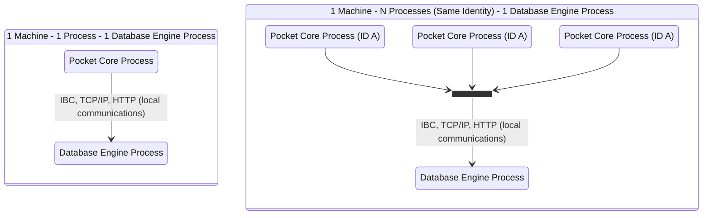
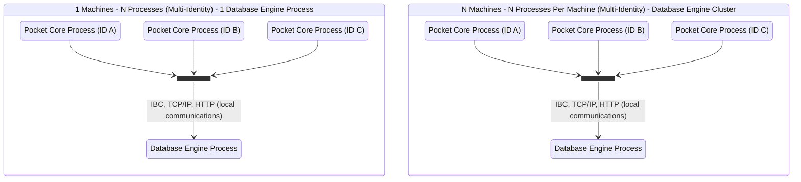
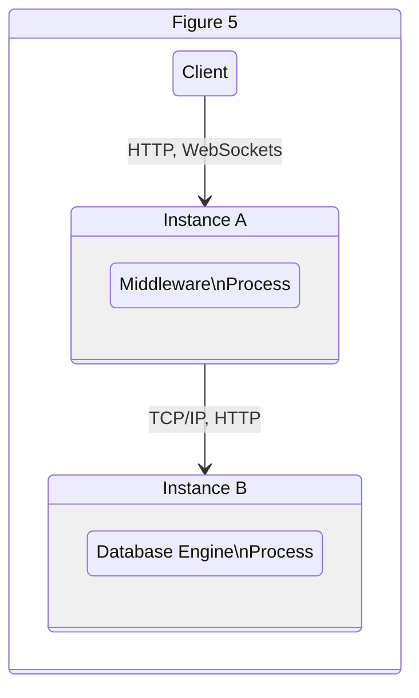
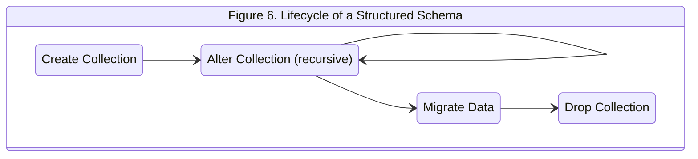
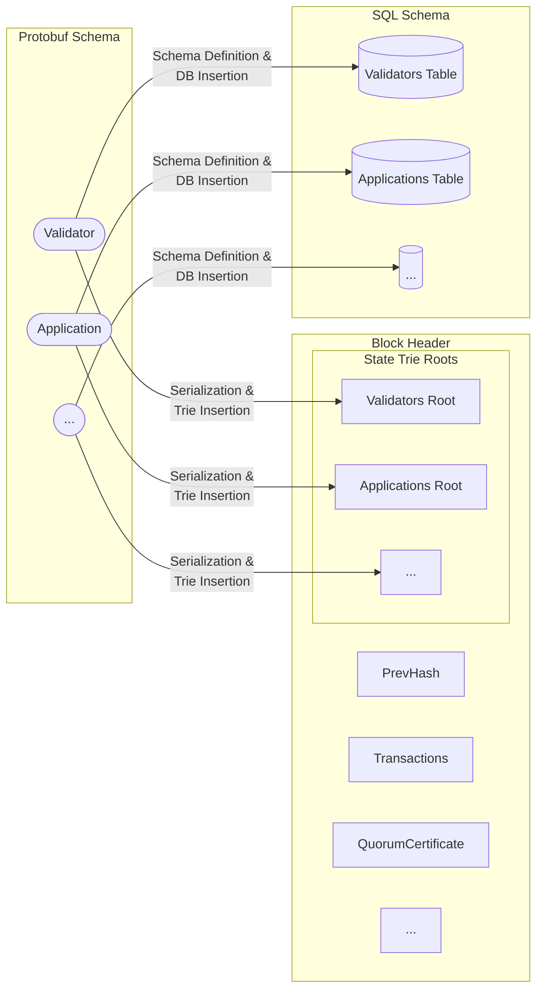

# Pocket Network 1.0 Persistence Module Specification: Tamper Proof Hybrid Mutable Database Persistence Model <!-- omit in toc -->

<p align="center">
    Luis Correa de León<br>
    @luyzdeleon<br>
    Version 1.0.2
</p>

- [Overview](#overview)
- [Requirements](#requirements)
- [Specification](#specification)
  - [1. Client-Server Architecture](#1-client-server-architecture)
    - [1.1. Overview](#11-overview)
    - [1.2. Database Engine](#12-database-engine)
      - [1.2.1. Configuration](#121-configuration)
    - [1.3. Error Handling](#13-error-handling)
      - [1.3.1 Database Engine Error Handling](#131-database-engine-error-handling)
      - [1.3.2 Middleware Error Handling](#132-middleware-error-handling)
  - [2. Persistence Client Middleware](#2-persistence-client-middleware)
    - [2.1. Overview](#21-overview)
    - [2.2. Persistence Datasets](#22-persistence-datasets)
    - [2.2.1 Datasets Schema Definition Mechanism](#221-datasets-schema-definition-mechanism)
      - [2.2.1.1. State Dataset - Schema definition](#2211-state-dataset---schema-definition)
      - [2.2.1.2. State Versions De-duplication Strategy](#2212-state-versions-de-duplication-strategy)
      - [2.2.1.3. Idempotent Writes and Updates](#2213-idempotent-writes-and-updates)
    - [2.3. Deterministic Write mechanism](#23-deterministic-write-mechanism)
  - [3. Blockchain State Validation Architecture](#3-blockchain-state-validation-architecture)
    - [3.1. Overview](#31-overview)
    - [3.2. Immutable State Schema](#32-immutable-state-schema)
      - [3.2.1. Data Encoding](#321-data-encoding)
      - [3.2.2. Cumulative Versioning](#322-cumulative-versioning)
      - [3.2.3. State Structure Verification](#323-state-structure-verification)
      - [3.2.4. Patricia Merkle Trie Persistence](#324-patricia-merkle-trie-persistence)
      - [3.2.5. Immutable State Transition Algorithm](#325-immutable-state-transition-algorithm)
- [Dissenting Opinions / Attack Vectors / FAQ](#dissenting-opinions--attack-vectors--faq)
  - [<span style="text-decoration:underline;">1. Why not just store the state in a tree like every other blockchain?</span>](#1-why-not-just-store-the-state-in-a-tree-like-every-other-blockchain)
  - [<span style="text-decoration:underline;">2. Can an attacker just modify the mutable database and make a node commit to an invalid state?</span>](#2-can-an-attacker-just-modify-the-mutable-database-and-make-a-node-commit-to-an-invalid-state)
  - [<span style="text-decoration:underline;">3. Isn’t this approach more susceptible to errors as there are more moving parts?</span>](#3-isnt-this-approach-more-susceptible-to-errors-as-there-are-more-moving-parts)
- [Candidate Features / Would Like to Haves / Open Questions](#candidate-features--would-like-to-haves--open-questions)
  - [<span style="text-decoration:underline;">1. Add a key/value store for caching data alongside a relational database that does not hinder performance and avoids too much data duplication.</span>](#1-add-a-keyvalue-store-for-caching-data-alongside-a-relational-database-that-does-not-hinder-performance-and-avoids-too-much-data-duplication)
- [References](#references)
- [WIP](#wip)

# Overview

Historically, blockchain clients have been developed with a focus on two use cases: **Validators** and **Full Nodes**. Validators are network actors who, given a particular condition indicated by the consensus protocol, get to propose and commit a block with transactions to the blockchain state. On the other hand, full nodes synchronize, validate and maintain copies of the state to be accessed by applications that want to query or transact with the blockchain. However, even though **Full Nodes** are mission-critical infrastructure components for application development, they are still seen as second-class citizens relative to **Validators** in terms of their importance. This is why various centralized blockchain infrastructure providers had to develop production paradigms such as [Alchemy's Supernode Architecture](https://www.alchemy.com/supernode) or [Infura's Cloud Architecture](https://blog.infura.io/building-better-ethereum-infrastructure-48e76c94724b/), highlighting the limitations of Blockchain Clients as production-grade infrastructure.

This document presents a specification for the Persistence Module of Pocket Network 1.0, which aims to tackle the persistence needs of Pocket Network 1.0 nodes: scalability, robustness, data integrity and security. This specification is composed of 3 pillars:

1. A **Client-Server Architecture** separating middleware processes from a generic database engine where the persistent data lives.
2. A **Persistence Client Middleware Specification** dictating how clients of the generic database engine behave to persist, update and query the datasets necessary for participating as Pocket Network actors.
3. A **Blockchain State Validation Architecture** fulfilling the tamper-proof requirements of blockchain databases allowing nodes to achieve consensus after every persistence dataset migration.

# Requirements

| Requirement                                                                                                                                                       | Pillar                                      |
| ----------------------------------------------------------------------------------------------------------------------------------------------------------------- | ------------------------------------------- |
| **Transaction Isolation**: Persistent data can be backuped and restored across different node operations.                                                         | Client-Server Architecture                  |
| **Portability**: It is possible to provide different implementations of the interface and database engine layers adhering to the same interface.                  | Client-Server Architecture                  |
| **Individual Scalability**: The middleware can be scaled independently from the database engine.                                                                  | Client-Server Architecture                  |
| **Fault Tolerance**: Failures can be isolated between the middleware and database engine.                                                                         | Client-Server Architecture                  |
| **Multi-Process Concurrency**: Multiple processes can access the database engine concurrently.                                                                    | Client-Server Architecture                  |
| **State Dataset Versioning**: Every version of the `Blockchain State` dataset must be versioned.                                                                  | Persistence Client Middleware specification |
| **"Byte-perfect consistency" data encoding**: Data is encoded in a format that allows for byte-perfect equality checks.                                           | Persistence Client Middleware specification |
| **Schema Definition Mechanism**: Dataset structures must be schematized and schema changes are only allowed between different versions of the dataset.            | Persistence Client Middleware specification |
| **Deterministic Write Mechanism**: Faulty writes that compromise the integrity of the state can be rolled back.                                                   | Persistence Client Middleware specification |
| **Idempotent Dataset Updates**: The same update operation to a dataset, applied multiple times, must yield the same dataset state.                                | Persistence Client Middleware specification |
| **Cumulative State Versioning**: Each new version of the state must be cumulative by only adding deltas of the state change without recomputing the entire state. | Blockchain State Validation architecture    |
| **Dataset Integrity Verification**: It is easy to verify if a particular element belongs to a particular version of a specific state dataset.                     | Blockchain State Validation architecture    |

# Specification

## 1. Client-Server Architecture

### 1.1. Overview

In the context of the Persistence Module, a **client-server architecture** indicates a separation between the **middleware** and the **database engine**. In practice, this allows for multiple types of system deployments illustrated in Figures 1-4.





### 1.2. Database Engine

The selected **Database Engine**, which will be referred to as “**the database engine**” will be [PostgreSQL](https://www.postgresql.org/). The accompanying research document to this Pre-Planning Specification contains the research through which this decision was made. In addition, PostgreSQL has multiple desirable properties that satisfy requirements such as **Schema Definition Mechanism**, **Deterministic Write Mechanism **and** Idempotent Dataset Updates**.

#### 1.2.1. Configuration

When implementing a client-server architecture, several approaches can establish communication between the middleware and the database engine. Below we describe a data structure that contains the necessary attributes:

```
type DBConfiguration interface {
	Host() URL           # host url where to contact the database engine e.g. 1.2.3.4, localhost
	Username() String    # the username used by the middleware to access the database engine
	Password() String    # the password used by the middleware to access the database engine
}
```

On the database engine, the following configurations need to be specified:

1. User role: 1 of **Servicer**, **Validator**, **Fisherman**, **Archival** or **Full Node**.
2. Schemas: 1 or more of **Consensus**, **State**, **Mempool** and **Local**.

These configurations will be referenced throughout this specification to satisfy requirements and complement other mechanisms at different module layers.

### 1.3. Error Handling

Because of the separation of concerns between middleware and the database engine, an error handling architecture at the system deployment level must be established to allow fault tolerance strategies in the execution of the system.

#### 1.3.1 Database Engine Error Handling

There are three main use cases of error handling when the database engine is the one at fault:

1. **Configuration Errors**: In the case of configuration errors, the middleware must return the user any given errors by the database engine and surface them via logs or other system-wide notifications. This is a **critical** error and must stop the execution of the system until resolved.
2. **Read/Write Errors** or **Database Engine Unavailable**: If any of these errors are returned by the database engine, the middleware can opt into one of the following fallback mechanisms:
   - Provision an in-memory database.
   - A secondary replica to point to.
   - A queue of operations to be applied on top of the database once normal operations are restored.
   - In addition to these fallback mechanisms, the middleware must surface the issue via logs or other system-wide notifications. Again, this is a **critical** error and must stop the execution of the system until resolved unless a fallback mechanism is configured.

#### 1.3.2 Middleware Error Handling

The database engine will be configured to handle the following middleware error scenarios:

1. **Invalid data format writes**: In the case of the middleware trying to write data in unsupported formats, the database engine must be equipped to reject these requests with a valid error message to be surfaced by the middleware client via logs or other system-wide notifications.
2. **Long-running queries**: All queries to the database engine must be capped to a maximum query timeout and a maximum data output. These must be set at the database engine level configured in case the middleware is to request a query that goes out of bounds. In addition, the database engine must be equipped to reject these requests with a valid error message to be surfaced by the middleware client via logs or other system-wide notifications.

## 2. Persistence Client Middleware

### 2.1. Overview

In the context of the Persistence Module, the **middleware** is the software that sits between the **client** and the **database engine**, hence “in the middle” as shown the in the Figure 5.



In order to ensure all the requirements described in this document are met, a set of expected behaviours and attributes the middleware is responsible for will need to be defined.

### 2.2. Persistence Datasets

A **dataset** is a group of collections that is logically related. For Pocket Network 1.0, we are proposing the following datasets:

1. **Consensus dataset**: Contains all the blocks, transactions and quorum certificates of the Pocket Network blockchain. Validators need this data set to achieve Byzantine agreement and for other nodes to verify Byzantine Fault Taulrenace.
2. **Mempool dataset**: Contains a list of all transactions submitted to the Pocket Network but not yet finalized on the blockchain. This dataset is populated through messages gossiped throughout the network and is transient in nature.
3. **State dataset**: Contains the specific Pocket Network state (nodes, apps, params, accounts, etc.) for a particular height. A hashed version of the state dataset is called the **state hash**.
4. **Block store dataset**: A collection of (state dataset, state hash) pairs for every block height stored on the node.
5. **Local dataset**: Contains all the utility-specific data needed for the different actors of the network to achieve their functions. This dataset is local and only affects an individual node operation.

Each dataset can be individually accessed by a particular middleware instance, which allows re-usability of the data in multi-node and multi-process operations.

### 2.2.1 Datasets Schema Definition Mechanism

Each dataset mentioned above contains one or more **collections**, with each collection defined via a **structured schema.** For Pocket Network 1.0, since we chose a SQL database engine, we can morph the schema using the **migrations paradigm**. Migrations are a series of phases in a structure schema lifecycle, explained in Figure 6.



#### 2.2.1.1. State Dataset - Schema definition

The state dataset presents a unique challenge, given the fact that it requires appropriate manipulation and is a requirement for consensus (see more in [Section 3](#3-blockchain-state-validation-architecture) of this specification). For this reason, we are proposing a unique **migration structure**.

Migrations will be tied to specific heights, ensuring that nodes across different state heights (e.g. during state sync) can independently reproduce and verify a local **state schema** at a particular height. This will enable each node to produce the immutability proofs included in the blocks, which will be checked against the block hashes during validation. Refer again to Figure 6 for a lifecycle of the state schema.

#### 2.2.1.2. State Versions De-duplication Strategy

Given the fact that the selected database engine describes collections in a **tabular schema**and that the **state dataset** has to be versioned on every change, a deduplication strategy is needed to avoid data redundancy and decrease lookup and scan overhead when operating against any given **state collection**. For this reason, we are proposing the following fields in every state collection:

- **Created At (created_at):** Indicates the height at which the structure is **added to the dataset.**
- **Deleted At (deleted_at):** Indicates the height at which the structure was **removed from the dataset.**

By leveraging these properties, we can define the **Create**, **Update** and **Delete** operations of the [CRUD](https://en.wikipedia.org/wiki/Create,_read,_update_and_delete) set:

- **Create**: Insert a new structure into the collection with the given **Created At (created_at)** value indicating at which height the structure is inserted.
- **Update**: Update the **Deleted At (deleted_at)** field of the structure to the height where a change/update occurs. Subsequently, insert a new record of the updated structure with the given **Created At (created_at)** value indicating at which height the structure is being updated (i.e. created).
- **Delete**: Update the **Deleted At (deleted_at)** field of the structure to the height at which the deletion is happening.

CRUD's **Read** operation naturally follows from the ability to query a SQL database. These attributes and processes allow us to fulfill the different requirements of a state dataset:

- **Historical querying**: Query the same structure throughout any given height by filtering by the **Created At (created_at) **and** Deleted At (deleted_at).**
- **Atomic state transitions**: Every state transition is logged atomically without impacting previous state versions.

#### 2.2.1.3. Idempotent Writes and Updates

To implement idempotency to our persistence layer, we need to define the following set of rules when doing **Create**, **Update** or **Delete** operations over collections and structures:

- When creating a brand new structure, the operation must include all of its uniquely-identified fields. This will help avoid collisions between existing and new structures.
- When updating an existing structure, all uniquely-identified fields must be indicated explicitly in the operation. Specifically, timestamp fields such as **Created At (created_at)** and **Deleted At (deleted_at)** must also be specified explicitly to avoid collisions and discrepancies between the structure's data and metadata.
- When deleting a structure, all uniquely-identified fields must be indicated in the operation. In addition, deletion through filters or via **"all"** will not be permitted by the system.

### 2.3. Deterministic Write mechanism

Most modern SQL DBMS (database management system) implementations utilize the **Transaction model** to indicate a transaction as a group of operations to be performed sequentially and logically grouped. This is called **[ACID]**(https://en.wikipedia.org/wiki/ACID) (atomicity, consistency, isolation, durability), which are the properties that allow the dataset to stay consistent across operations by enabling capabilities such as rollbacks in case one of the operations comprising an ACID transaction fails or yields an inconsistent dataset state.

Our chosen database engine, **Postgresql**, defines a transaction model in its official documentation [here](https://www.postgresql.org/docs/current/tutorial-transactions.html). It also defines the ability to rollback transactions [here](https://www.postgresql.org/docs/current/sql-rollback-prepared.html). These mechanisms establish the ability to achieve deterministic writes while avoiding issues such as data corruption and race conditions.

<!-- TODO(olshansky): Dive into a deeper discussion of how multiple each "utility level transaction" can be decomposed into multiple DB transactions, each of which is atomic in itself. The middleware layer can aggregate them a priori into one DB transaction, OR, the DB engine can be leveraged via conflicts & upserts to immitiate this behaviour for a simpler implementation. In summary, all the utility level transactions, which may or may not have a 1:1 mapping to DB transactions, are applied atomically in the context of a single height.-->

## 3. Blockchain State Validation Architecture

### 3.1. Overview

The **state dataset** contains the result of each set of state transitions indicated by the transactions for a given height. This provides the **state dataset** the desired property of **immutability** because the resulting state at any given height is one of the most critical inputs of the consensus process of the Pocket Network. Furthermore, this specification contains a mechanism that leverages [Merkle Patricia Tries](https://eth.wiki/en/fundamentals/patricia-tree) as a data structure that helps prove the integrity of the state dataset at any given height, free of any modifications, including the selected encoding scheme (e.g. Protobuf](https://developers.google.com/protocol-buffers)).

### 3.2. Immutable State Schema

We will refer to the **state dataset** as a group of collections that will conform to the immutable state schema. Every structure in the collection will become a leaf in a Merkle Patricia Trie, yielding a Merkle Root. Every Merkle root in the dataset will be concatenated in lexicographical order based on the collection identifier and hashed using **SHA256** function to produce what we will refer to as the **state hash**.

<!-- TODO(olshansky): Add a diagram for this now or later to make it easier to understand how the data is stored -->

Each state hash will be persisted alongside a cryptographic digital signature computed via a designated private key, serving as proof for validation during local state computation. This proof will be utilized to avoid recalculating previous states and allow the system, provided the same private key, to have a high degree of confidence in its computed state. The state can be recalculated using the state hash algorithm if the proof has been tampered with. This proof will be referred to as the **state computation proof.**

#### 3.2.1. Data Encoding

We need to use a generic data encoding format to provide a uniform dataset for each leaf in every tree of the immutable state schema, which will be deterministic in its computation. We have chosen the [Protobuf](https://developers.google.com/protocol-buffers) implementation for this task. As outlined in the accompanying research document, Protobuf fulfills all the requirements and performance benchmarks for this implementation. Note that while Pocket Network V1.0 will use a standardized data encoding protocol, likely to be Protobuf, it does not exclude other protocols (e.g. [FlatBuffers](https://google.github.io/flatbuffers)) from being used in future major releases.

#### 3.2.2. Cumulative Versioning

An attribute of Merkle Patricia Tries is that every new operation for a given trie doesn’t require the recomputation of the entire trie, rather only the **branch elements** that are being updated, satisfying our requirement of **Cumulative State Versioning**. This enables persisting deltas across versions of the immutable state schema rather than copies of the entire trie structure.

#### 3.2.3. State Structure Verification

To verify any given structure state in a Merkle Patricia Trie, we need to provide a Merkle proof and the computed **leaf node** we are trying to prove. The use of Protobuf as our chosen data encoding protocol enables operation.

#### 3.2.4. Patricia Merkle Trie Persistence

A key-value store schema will be required to persist the immutable state schema. We can persist this as part of the **state dataset.**

#### 3.2.5. Immutable State Transition Algorithm

To compute transitions of the **state dataset** to the **immutable schema**, we present an algorithm that, given a series of **state transitions**, the **current immutable schema** and a **private key** can compute the new **state hash** and the **state computation proof**. See Algorithm 1 as a reference.


# Dissenting Opinions / Attack Vectors / FAQ

## <span style="text-decoration:underline;">1. Why not just store the state in a tree like every other blockchain?</span>

Pocket Network's primary difference from most other blockchains is that it is an **application-specific blockchain** optimized to be a decentralized Web3 RPC middleware layer. Unlike smart contract blockchains, arbitrary data cannot be uploaded by the users, as that would break the immutable state schema based on predefined collections of structures.

However, this specification still provides a Blockchain State Validation architecture, which leverages Patricia Merkle Tries to create a tamper-proof representation of the blockchain state at any given height. This achieves the property of having immutable yet still upgradable schemas.

The only tradeoff concerns data replication of the immutable database schema, which can be solved via pruning and hashing.

## <span style="text-decoration:underline;">2. Can an attacker just modify the mutable database and make a node commit to an invalid state?</span>

This attack vector can still exist in persistence architectures built only on top of trees. However, this would break functionality when proof for the local state is computed by yielding an invalid state hash.

## <span style="text-decoration:underline;">3. Isn’t this approach more susceptible to errors as there are more moving parts?</span>

The only additional step this architecture includes is computing the leaf nodes due to the operations on the mutable database. However, we believe that this is a valid tradeoff as it can be easily managed as a separate sub-module of the persistence layer.

# Candidate Features / Would Like to Haves / Open Questions

## <span style="text-decoration:underline;">1. Add a key/value store for caching data alongside a relational database that does not hinder performance and avoids too much data duplication.</span>

This optimization can be tackled in future versions of the specification. Specifically, building interfaces between the persistence module and other caching technologies such as [Redis](https://redis.io/) or [ElasticSearch](https://www.elastic.co/) are available.

# References

[1] [Persistence Spec Research Document](RESEARCH.md)

[2] [https://en.wikipedia.org/wiki/Create,\_read,\_update_and_delete](https://en.wikipedia.org/wiki/Create,_read,_update_and_delete)

[3] [https://en.wikipedia.org/wiki/ACID](https://en.wikipedia.org/wiki/ACID)

[4] [https://www.postgresql.org/docs/current/tutorial-transactions.html](https://www.postgresql.org/docs/current/tutorial-transactions.html)

[5] [https://developers.google.com/protocol-buffers](https://developers.google.com/protocol-buffers)

[6] [https://eth.wiki/fundamentals/rlp](https://eth.wiki/fundamentals/rlp)

# WIP


