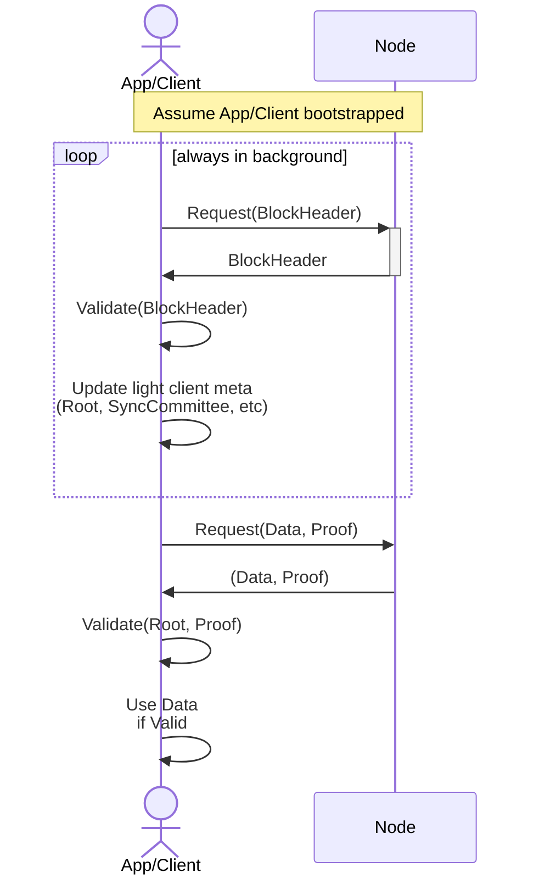

# Ideas

There are lots of ideas that have been discussed

## Session Protocol

- [ ] Look into more fluid mechanisms of moving rate limits across a cluster of Servicer's rather than simply `Relays / NumServicers`
  - [ ] Explain that Portal could help in redirecting traffic in the right direction
- [ ] Define the protocol for "Session Fuzzing" to account for relays sent/serviced close to session boundaries
- [ ] Enable multiple RelayChains per session

### Servicer Protocol

- [ ] Remove the servicer -> watcher interaction to a an on-chain mechanism similar to [Claim & Proof in V0](https://github.com/pokt-network/pocket-core/blob/staging/doc/specs/reward_protocol.md)
- [ ] Enable revenue sharing through multiplicity of the OperatorPublicKey
- [ ] Expand Rate Limiting algorithm so different requests cost different amounts

## Portal Protocol

- [ ] If an Application delegates to multiple portals, add a mechanism that monitors how many relays each portal can do; https://github.com/pokt-network/pocket-network-protocol/pull/25/files#r1091248703
- [ ] Rename Portal Actor to Portal Actor
- [ ] Iterate and expand on incentive / penalization mechanisms (lots of opportunity here)
- [ ] Provide details for off-chain "business models" enabled by Pocket

## Governance Protocol

- [ ] Design & explain the mechanism being researched by Jack
- [ ] Add k-of-n threshold signatures (or multisgs) throughout the document

## Watcher Protocol

- [ ] Provide a geometric distribution and show why Watcher lying about TestScores is unlikely
- [ ] Permissionless watcher
- [ ] Dive deeper into the use of Proof-of-Sequential work algorithms (Proof of History, Proof of Space Time, etc...) algorithms for volume estimation
- [ ] Look into replacing the ProofAndClaim/CommitAndReveal workflow with more modern zero-knowledge approaches
- [ ] Grade watcher based on how normally distributed their samples are

## General

- [ ] All staked actors (DAO, Portals, Watcher, etc...) get a fraction of the block rewards for continued incentives
- [ ] Integration with protocols like NYM or HOPR for native opt-in RPC security / mixing / obfuscation
- [ ] Multiple operator / output addresses per actor
- [ ] Delegated staking (validation, servicing, monitoring, etc...)
- [ ] Revenue Sharing
- [ ] How long should evidence be kept around for for audit purposes
- [ ] Extend `Memo` to be a special type containing an ID (key) and a value. For example, ID 1 could represent a string, ID 2 could represent an IPFS URL, etc...

## Tokenomics

- [ ] Build models for inflationary / deflationary economics
- [ ] Build models for likelihood of attacks (w/ and w/o trust delegation)
- [ ] Build model for self dealing attacks
- [ ] Build models when/how Application stake burning is enabled

## Client Side Challenge Validation

- [ ] Document "Would you like a proof with that?" idea

- [ ] Document mitigation for Address Swap & Address Poisoning Attacks

