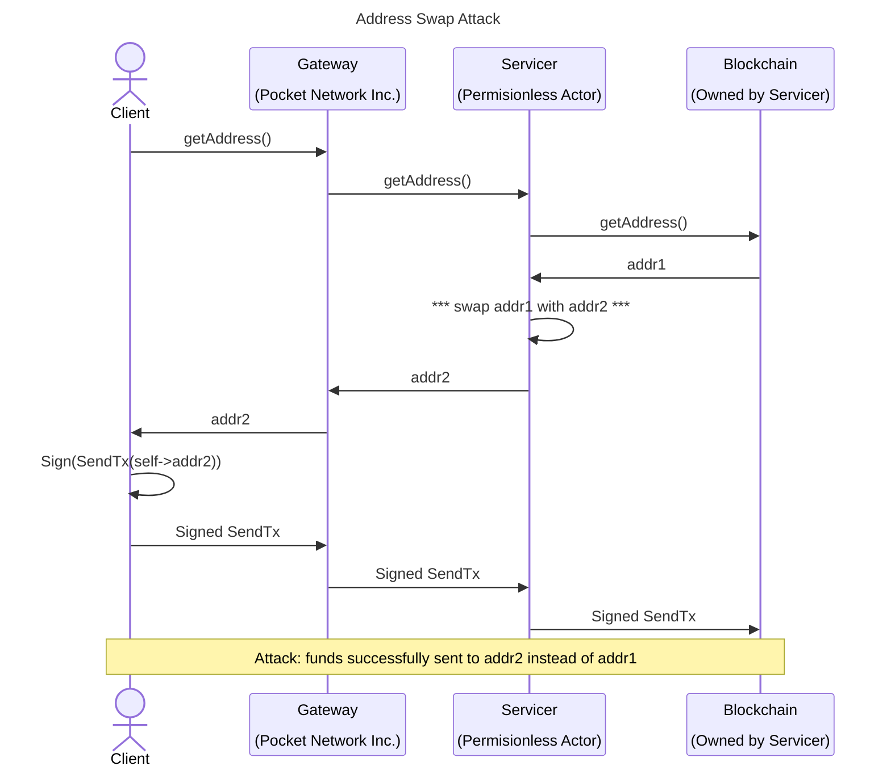
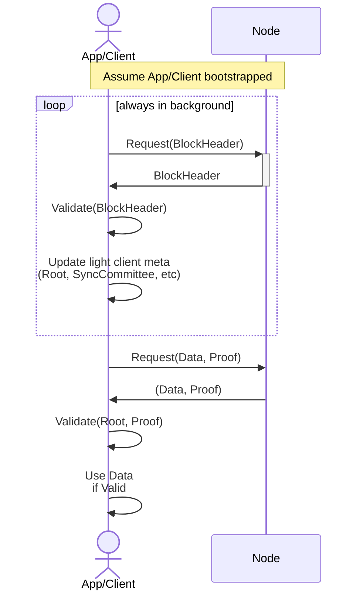

# Ideas

There are lots of ideas that have been discussed

## Session Protocol

- [ ] Look into more fluid mechanisms of moving rate limits across a cluster of Servicer's rather than simply `Relays / NumServicers`
  - [ ] Explain that Gateway could help in redirecting traffic in the right direction
- [ ] Enable multiple RelayChains per session
- [ ] Enable registration in multiple GeoLocations per actor

### Servicer Protocol

- [ ] Enable revenue sharing through multiplicity of the OperatorPublicKey
- [ ] Expand Rate Limiting algorithm so different requests cost different amounts

## Gateway Protocol

- [ ] Iterate an expend on incentive / penalization mechanisms (lots of opportunity here)
- [ ] Provide details for off-chain "business models" enabled by Pocket

## Governance Protocol

- [ ] Design & explain the mechanism being researched by Jack
- [ ] Add k-of-n threshold signatures (or multisgs) throughout the document

## Fisherman Protocol

- [ ] Look into the use of Proof-of-Sequential algorithms for volume estimation
- [ ] Look into replacing the ProofAndClaim/CommitAndReveal workflow with more modern zero-knowledge approaches

## General

- [ ] Enable delegated staking (validation, servicing, monitoring, etc...)

## Tokenomics

- [ ] Build models for inflationary / deflationary economics
- [ ] Build models for likelihood of attacks (w/ and w/o trust delegation)
- [ ] Build model for self dealing attacks
- [ ] Build models when/how Application stake burning is enabled

## Client Side Challenge Validation

- [ ] Document mitigation for Address Swap & Address Poisoning Attacks

- [ ] Document "Would you like a proof with that?" idea

