# Pocket 1.0 Utility Module Specification <!-- omit in toc -->

<p align="center">
    @andrewnguyen22 - Andrew Nguyen<br>
    @BenVanGithub - Shawn Regan<br>
    @olshansk - Daniel Olshansky<br>
    Version 1.0.1 - Jan 2023
</p>

- [1. Overview](#1-overview)
  - [1.1 The RPC Trilemma](#11-the-rpc-trilemma)
  - [1.2 Protocol Actors](#12-protocol-actors)
  - [1.3 Background Context](#13-background-context)
- [2. Requirements](#2-requirements)
- [3 Specification](#3-specification)
  - [3.1 Session Protocol](#31-session-protocol)
    - [3.1.1 Dispatch / Actor Selection](#311-dispatch--actor-selection)
    - [3.1.2 RelayChain](#312-relaychain)
    - [3.1.3 GeoZone](#313-geozone)
    - [3.1.4 Actor Substitution](#314-actor-substitution)
    - [3.1.5 Rate Limiting](#315-rate-limiting)
    - [3.1.6 Interface](#316-interface)
  - [3.2 Servicer Protocol](#32-servicer-protocol)
    - [3.2.1 Staking](#321-staking)
    - [3.2.2 Network SLA (Service Level Agreement)](#322-network-sla-service-level-agreement)
    - [3.2.3 Report Cards \& Test Scores](#323-report-cards--test-scores)
    - [3.2.4 Volume Estimation](#324-volume-estimation)
    - [3.2.5 Salary Eligibility \& Distribution](#325-salary-eligibility--distribution)
    - [3.2.5 Servicer Pausing](#325-servicer-pausing)
    - [3.2.6 Parameter Updates](#326-parameter-updates)
    - [3.2.7 Stake Burning](#327-stake-burning)
    - [3.2.8 Unstaking](#328-unstaking)
  - [3.3 Fisherman Protocol](#33-fisherman-protocol)
    - [3.3.1 Election](#331-election)
    - [3.3.2 Staking](#332-staking)
    - [3.3.3 Sampling Protocol](#333-sampling-protocol)
    - [3.3.4 Incognito Sampling](#334-incognito-sampling)
    - [3.3.5 Salary Distribution](#335-salary-distribution)
    - [3.3.6 Test Score Submission](#336-test-score-submission)
    - [3.3.7 Parameter Updates](#337-parameter-updates)
    - [3.3.8 Fisherman Pause](#338-fisherman-pause)
    - [3.3.9 Unstaking](#339-unstaking)
    - [3.3.10 DAO Monitoring](#3310-dao-monitoring)
  - [3.4 Application Protocol](#34-application-protocol)
    - [3.4.1 Staking](#341-staking)
    - [3.4.2 Parameter Updates](#342-parameter-updates)
    - [3.4.3 Unstaking](#343-unstaking)
    - [3.4.4 Stake Burning](#344-stake-burning)
  - [3.5 Gateway Protocol](#35-gateway-protocol)
    - [3.5.1 OAuth](#351-oauth)
    - [3.5.2 Application w/o Gateway](#352-application-wo-gateway)
    - [3.5.2 Application Delegation](#352-application-delegation)
    - [3.5.3 Application Servicing](#353-application-servicing)
    - [3.5.4 Off-Chain Benefits](#354-off-chain-benefits)
    - [3.5.5 Registration](#355-registration)
  - [3.6 Validator Protocol](#36-validator-protocol)
    - [3.6.1 Validator Registration](#361-validator-registration)
  - [3.7 Account Protocol](#37-account-protocol)
    - [3.7.2 Send Transaction](#372-send-transaction)
    - [3.7.3 Pool](#373-pool)
  - [3.8 State Change Protocol](#38-state-change-protocol)
  - [3.9 Governance Protocol](#39-governance-protocol)
    - [3.9.1 Parameter Updates](#391-parameter-updates)
    - [3.9.2 DAO Treasury](#392-dao-treasury)
- [4. Sequence](#4-sequence)
  - [4.1 ProtoGateFish](#41-protogatefish)
  - [4.2 Castaway](#42-castaway)
  - [4.2 Fishermen](#42-fishermen)
  - [4.3 CastNet](#43-castnet)
- [5. Attack Vectors](#5-attack-vectors)
  - [5.1 Attack Category Types](#51-attack-category-types)
    - [5.1.1 Profit Seeking Passive](#511-profit-seeking-passive)
    - [5.1.2 Profit Seeking Active](#512-profit-seeking-active)
    - [5.1.3 Collusion Passive](#513-collusion-passive)
    - [5.1.4 Collusion Active](#514-collusion-active)
    - [5.1.5 Target Network Isolation (DDoS)](#515-target-network-isolation-ddos)
    - [5.1.6 Hacker](#516-hacker)
    - [5.1.7 Inflation, Deflation](#517-inflation-deflation)
    - [5.1.8 Mad Man Attacks](#518-mad-man-attacks)
      - [5.1.8.1 Mad Man Lazy](#5181-mad-man-lazy)
      - [5.1.8.2 Mad Man Hacker](#5182-mad-man-hacker)
      - [5.1.8.3 Masochistic Mad Man](#5183-masochistic-mad-man)
  - [5.2 Attack Examples](#52-attack-examples)
    - [5.2.1 Fisherman \<\> Servicer Collusion](#521-fisherman--servicer-collusion)
    - [5.2.2 Fisherman attacking Servicers through TestScores (Collusion passive, Hacker, Mad Man Lazy, Inflation/Deflation)](#522-fisherman-attacking-servicers-through-testscores-collusion-passive-hacker-mad-man-lazy-inflationdeflation)
    - [5.2.3](#523)
    - [5.2.X](#52x)
    - [5.2.X](#52x-1)
    - [5.2.X](#52x-2)
    - [5.2.X](#52x-3)
    - [5.2.X](#52x-4)
- [6. Dissenting Opinions (FAQ)](#6-dissenting-opinions-faq)
- [7. Future Research \& Candidate Features](#7-future-research--candidate-features)
- [References](#references)

## 1. Overview

This document describes Pocket Network’s Utility Module: an account based, state machine protocol that enables applications to permissionlessly access high quality decentralized Web3 services without the need of maintaining clients themselves.

### 1.1 The RPC Trilemma

Pocket Network aims to solve the RPC Trilemma:

1. **R**eliability: Uptime, geo-political redundancy, trustless, etc...
2. **P**erformance: QoS, latency, geographic decentralization, etc...
3. **C**ost: Web3 access, infrastructure maintenance, tokenomic incentivization & penalties etc...

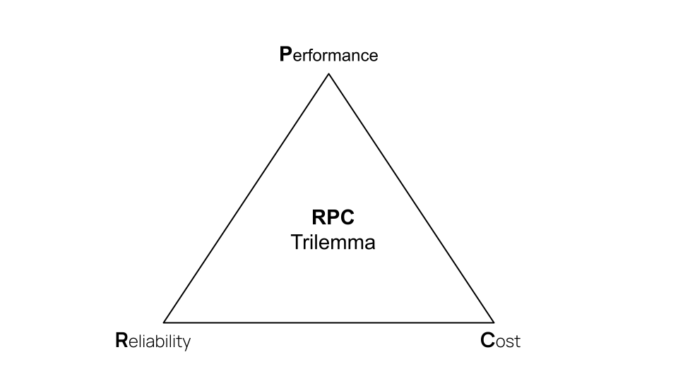

### 1.2 Protocol Actors

This is achieved by defining a Utilitarian economy that proportionally incentivizes or penalizes the corresponding infrastructure providers based on their quality of the service. It is composed of the following actors:

- Registered **Applications** that purchase Web3 access over a function of volume and time
- Registered **Servicers** that provide Web3 access
- Elected **Fishermen** who grade and enforce the quality of the Web3 access provided by **Servicers**
- Registered **Gateways** that can be optionally used by **Applications** through trust delegation
- Registered **Validators** responsible for maintaining safety & liveness of the replicated state machine

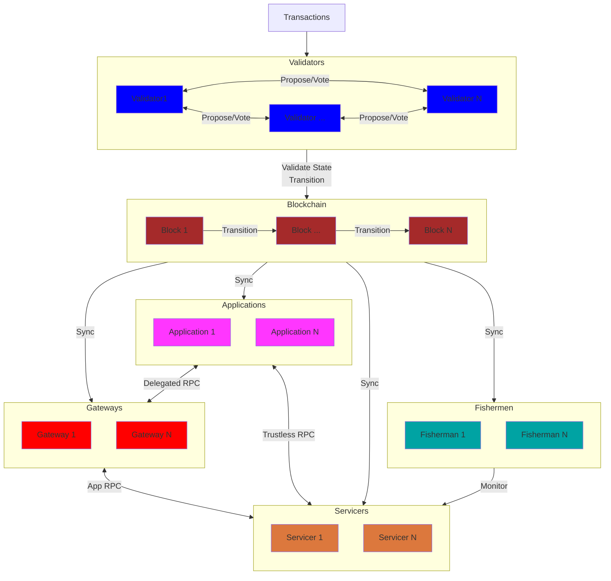

### 1.3 Background Context

Readers of this document must keep in mind the following:

1. This living document is subject to change. Ongoing R&D will shape the specification until it is formalized and finished.
2. This document represents one stage of Fisherman decentralization. Future iterations will aim to make Fisherman fully permissionless.
3. This document is not a complete Pocket Network whitepaper. It is a specification of the utility module components and background knowledge of the protocol internals is required.
4. This document is not an academic paper paper. The reader's knowledge of background concepts is implicitly assumed.
5. This document does not outline implementation specific interfaces or details.
6. This document is a foundation specifications and formally defined components/details will be added over time

## 2. Requirements

The specification must:

1. Enable Web3 access through a Utilitarian Economy leveraging native cryptocurrency capabilities
2. Account for both inflationary and deflationary economic scenarios
3. Incentivize actors within the protocol through competing offerings and economic penalties
4. Reward Servicers through a combination of quality of service, application demand volume, and services offered
5. Constraint service capacity through a combination of time, volume and cost
6. Account for gamification, collusion, and other attack vectors
7. Enable Applications to gain permissionless Web3 access without maintaining their own infrastructure
8. Enable Applications to optionally delegate trust to Gateways that ease the use of Web3 access

The current iteration of the specification must not necessarily:

1. Replace the safety guarantees of Applications maintaining their own infrastructure or using light clients
2. Enable permissionless registration of Fisherman actors on initial launch
3. Does not quantifiably model the underlying tokenomics of the system

## 3 Specification

The logical abstraction of the specification system is comprised of multiple sub-protocols listed below. Interfaces and diagrams presented are intended as aiding guidelines rather than definitive implementation details.

### 3.1 Session Protocol

A `Session` is a time-based mechanism used to regulate the various interactions (Web3 access, monitoring, etc) between protocol actors to enable the Utilitarian economy in a fair and secure manner. A single session may extend multiple Blocks as determined by `SessionBlockFrequency`.

#### 3.1.1 Dispatch / Actor Selection

Under the Random Oracle Model, a Session can be seeded to deterministically select which group of actors will interact for some duration of time. This enables a random, deterministic and uniform distribution of Web3 access, provisioning and monitoring. It limits what work, and by whom, can be rewarded or penalized at the protocol layer.

The seed data for a session is an implementation detail that could be composed of multiple variables. It includes, but is not limited to, attributes such as `LatestBlockHash`, `Timestamp`, etc...

To start a new session, or retrieve the metadata for an existing / prior session, the Querier (e.g. Application, Client) can execute a request to any synched Full Node (protocol actor or not).

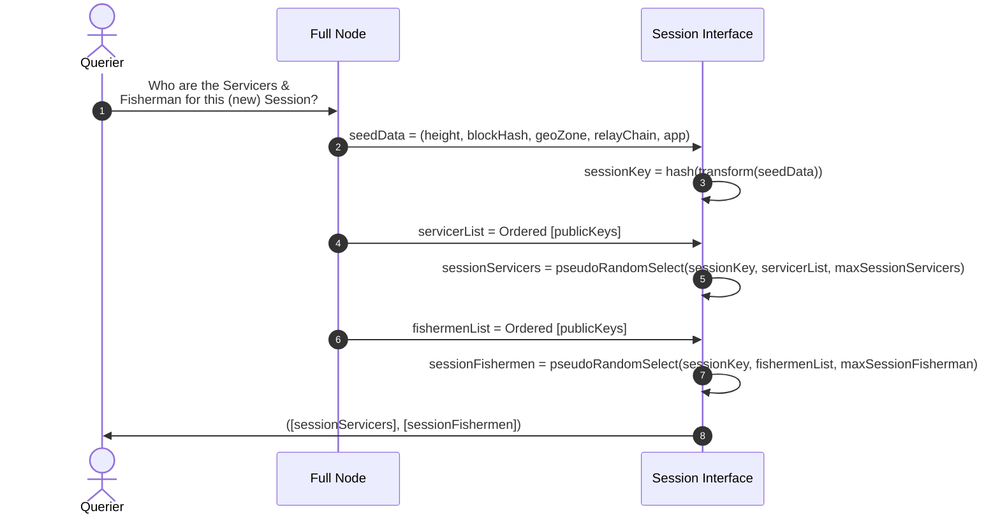

For illustrative purposes, an example implementation of `NewSession` could be:

```go
func NewSession(sessionHeight, lastBlockHash, geoZone, relayChain, appPubKey) Session {
  key = hash(concat(sessionHeight, lastBlockHash, geoZone, relayChain, appPubKey))
  servicers = getClosestServicers(key, geoZone, numServicers)
  fishermen = getClosesFishermen(key, geoZone, numFishermen)
  return Session{sessionHeight, geoZone, relayChain, appPubKey, servicers, fishermen}
}
```

#### 3.1.2 RelayChain

A `RelayChain` is an identifier of the specified Web3 data source (i.e. a blockchain) being interacted with for that session.

For example, `0021` represents `Ethereum Mainnet` in Pocket Network V0.

#### 3.1.3 GeoZone

A `GeoZone` is a representation of a physical geo-location the actors advertise that they are in.

For example, `GeoZone 0001` could represent `US East`, but alternative coordinate systems such as [Uber's H3](https://h3geo.org) or [PostGIS](https://postgis.net/) could be used as well.

There is no formal requirement or validation (e.g. IP verification) for an actor to be physically located in the GeoZone it registers in. However, crypto-economic incentives promote actors to be close to where they are physically located to receive and provide the best service possible.

#### 3.1.4 Actor Substitution

Since a single Session extends multiple blocks, an actor could potentially send an on-chain transaction to exit (e.g. Unstake, Pause) prematurely. Any rewards for that Session for that actor are invalidated, and penalties may be applied. A replacement actor (e.g. a Servicer) will be found and dynamically added to the session in the closest following block.

#### 3.1.5 Rate Limiting

Rate limiting limits the amount of work (i.e. Web3 access) a Servicer can provide to an Application throughout the duration of a Session.

During each Session, the amount of POKT an Application has staked (see [Application Protocol](#34-application-protocol) for more details) is mapped to "Service Tokens" that represent the amount of work a Servicer can provide using the `SessionTokenBucketCoefficient` governance parameter. The [Token Bucket](https://en.wikipedia.org/wiki/Token_bucket) rate limiting algorithm is used to determine the maximum number of requests a Servicer can relay, and be rewarded for, thereby disincentivizing it process relays for the Application once the cap is reached.

- MaxRelays / NumServers for that session.
- Application Burn
- Best Effort
- Show validation of relays

At the beginning of the session, each Servicer initializes: `AppSessionTokens = (AppStakeAmount * SessionTokenBucketCoefficient) / NumServicersPerSession`. When one of the Servicers in the session is out of session tokens, the Application can continue to user others until they are all exhausted.

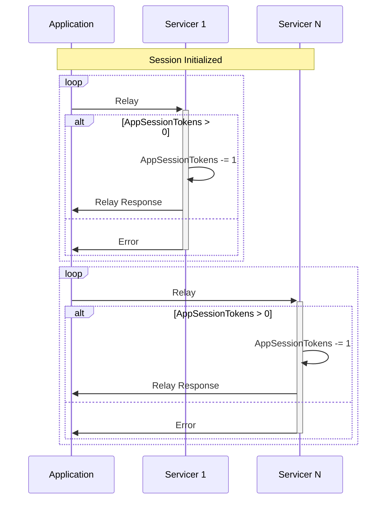

Note that this mechanism enables future iterations of the protocol where different types of request may vary the required number of `AppSessionTokens` per request.

#### 3.1.6 Interface

An illustrative example of the Session interface can be summarized as follows:

```go
type Session interface {
  NewSession(seeds ...interface{}) Session

  GetApplication() Application # The Application consuming Web3 access
  GetRelayChain() RelayChain   # The Web3 chain identifier being accessed this session
  GetGeoZone() GeoZone         # The physical geo-location where all the actors are registered
  GetSessionHeight() uint64    # The block height when the session started
  GetServicers() []Servicer    # The Servicers providing Web3 access
  GetFishermen() []Fisherman   # The Fisherman monitoring Web3 service
}
```

### 3.2 Servicer Protocol

A `Servicer` is a protocol actor that provisions Web3 access for Pocket Network Applications to consume. Servicers are the **supply** side of the Utilitarian Economy, who are compensated in the native cryptographic token, POKT, for their work, relaying RPC requests.

#### 3.2.1 Staking

In order to participate as a Servicer in Pocket Network, each actor is required to bond a certain amount of tokens in escrow while they are providing Web3 access. These tokens may be burnt or removed from the actor as a result of breaking the **Protocol’s Service Level Agreement**, a DAO defined set of requirements for the minimum quality of service.

Upon registration, the Servicer is required to provide the network with sufficient information to be paired with Applications. This includes the `GeoZone` it is in, `RelayChain`(s) it supports, and `ServiceURL`, the Pocket API endpoint exposed where its service can ne accessed. An optional `OperatorPublicKey` may be provided for non-custodial operation of the Servicer.

This registration message is formally known as the `StakeMsg`, and a Servicer can only start providing service once it is registered: the StakeMsg has been validated and included in a following block, modifying the World State. An illustrative example can be summarized like so:

```go
type ServicerStakeMsg interface {
  GetPublicKey()  PublicKey     # The public cryptographic id of the custodial account
  GetStakeAmount() BigInt       # The amount of uPOKT in escrow (i.e. a security deposit)
  GetServiceURL() ServiceURL    # The API endpoint where the Web3 service is provided
  GetRelayChains() []RelayChain # The flavor(s) of Web3 hosted by this Servicer
  GetGeoZone() GeoZone          # The physical geo-location identifier this Servicer registered in
  GetOperatorPubKey() PublicKey # OPTIONAL; The non-custodial pubKey operating this node
}
```

#### 3.2.2 Network SLA (Service Level Agreement)

Servicers are paid proportionally to how well their Relay responses meet the standards of the Network SLA. A `Relay` is an abstraction of a request/response cycle with additional security guarantees when interacting with Web3 resources. The quality of a service is measured by:

1. **Availability**: The Servicer's uptime
2. **Latency**: The Round-Trip-Time (RTT) of the the Servicer's response relative to when the request was sent
3. **Data Accuracy**: The integrity of the Servicer's response

#### 3.2.3 Report Cards & Test Scores

A `TestScore` is a collection of samples by a Fisherman of a Servicer, based on the SLA criteria outlined above, throughout the duration of a Session.

A `ReportCard` is the logical aggregation of multiple `TestScores` over an Actor's registration lifetime.

#### 3.2.4 Volume Estimation

The Application's Web3 usage volume is estimated through probabilistic hash collisions. This enables a concise proof of probabilistic volume, without requiring compute or memory intensive storage and aggregation. Similar to [Bitcoin's Difficulty](https://en.bitcoin.it/wiki/Difficulty), a `RelayVolumeDifficulty` governance parameter will be used to determine the "difficulty", and how relay counts must be estimated.

Each relay can be viewed as an independent Bernoulli Trial, that is either a volume applicable relay or not. A geometric distribution can be built of the number of relays that need to be serviced until an applicable relay is made. For example, if a SHA256 hash algorithm is used and `RelayVolumeDifficulty` represents 4 leading zeroes, the hash of each `(SignedRelay, SignedRelayResponse)` pair below `0x0000FFFFFFFFFFFFFFFFFFFFFFFFFFFFFFFFFFFFFFFFFFFFFFFFFFFFFFFFFFFF` will represent `65536` (16^4) relays.

A the end of each Session, the volume applicable relays are sent to the Fisherman for validation and salary distribution.

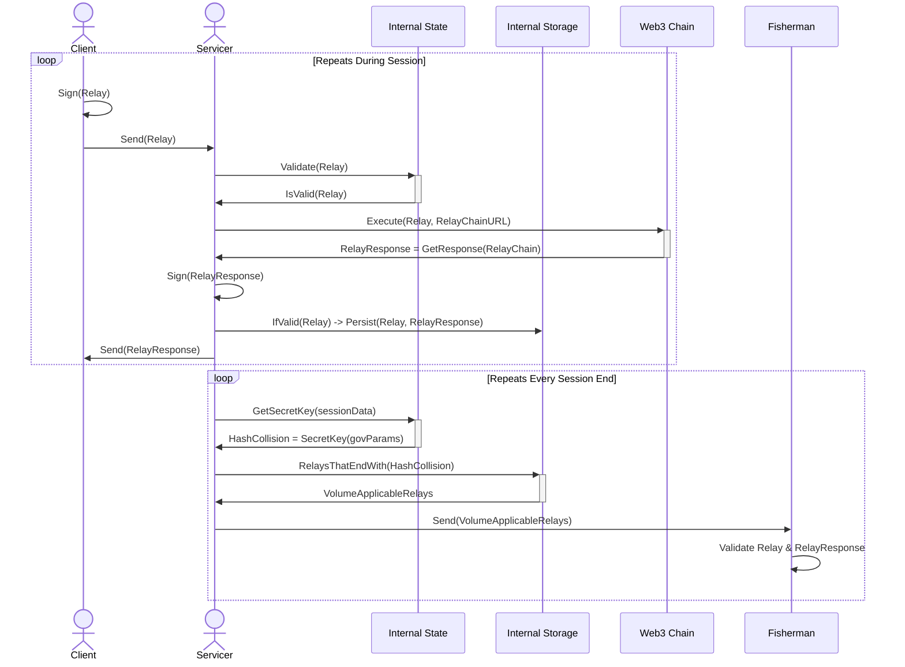

#### 3.2.5 Salary Eligibility & Distribution

A `ServicerSalary` is assigned to each individual Servicer based on their specific `ReportCard`, and is distributed every `SalaryBlockFrequency`. Salaries are distributed from the `TotalAvailableReward` pool, whose inflation is governed by Application volume of each `(RelayChain, GeoZone)` pair and scaled by the `UsageToRewardCoefficient` governance parameter.

A Servicer must accumulate `MinimumTestScoreThreshold` TestScores before it is eligible for salary distribution. A ReportCard can be viewed as a rolling average of the Servicer's performance, where TestScores are removed when either `TestScoreExpiration` is passed or the TestScore FIFO queue exceeds `MaxTestScores`.

Salary distribution is accomplished by aggregating the total volume estimated (see above) for a specific `(RelayChain, GeoZone)` pair (i.e. `TotalVolumeUsage`), multiplied by `UsageToRewardCoefficient`, and evenly divided into buckets per Servicer that exceed the minimum threshold (i.e. the `MaxServicerReward`). Each Servicer's reward is scaled proportionally to both their stake and their ReportCard. Tokens that are not allocated to a servicer are burnt.

For example, a 100% ReportCard results in zero burning of the maxServicerReward, while a 80% ReportCard results in 20% burning of the maxServicerReward. The rate of decrease continues linearly until the MinimumReportCardThreshold. Below the MinimumReportCardThreshold no reward is given to prevent cheap Sybil attacks and freeloading nodes.

The following is pseudo-code to illustrate this business logic:

```go
# Called for each (relayChain, geoZone) pair every SessionBlockFrequency
func DistributeRewards(relayChain, geoZone, height):
  totalVolumeUsage = WorldState.RetrieveTotalVolumeEstimate(relayChain, geoZone, height)
  totalAvailableReward = totalVolumeUsage * GovParams.UsageToRewardCoefficient(height)

  allServicers = WorldState.RetrieveEligibleServicers(relayChain, geoZone, height)
  eligibleServicers = filterServicers(allServicers, GovParams.MinimumTestScoreThreshold(height))

  maxServicerReward = totalAvailableReward / len(eligibleServicers)

  for servicer := eligibleServicers {
      stake = WorldState.GetServicerStake(servicer, height)
      score = WorldState.GetReportCard(servicer, height)

      burnPercent = getBurnPercent(stake, score, height)
      burnAmount = burnPercent * maxServicerReward

      awardTokens(servicers, maxServicerReward - burnAmount)
      burnTokens(relayChain, geoZone, burnAmount)
  }
```

```go

func DistributeSalaries(relayChain, geoZone, height) {
  servicers = getEligibleServicers(relayChain, geoZone, height)
  rewards = getAvailableReward(relayChain, geoZone, height)

}

func GetSalary(servicerReportCard, stakeAmountScore, totalAvailableReward, eligibleServicerCount) Salary {
  maxServicerReward = totalAvailableReward / eligibleServicerCount

  return netServicerReward
}
```

#### 3.2.5 Servicer Pausing

Servicers are able to gracefully pause their service (e.g. for maintenance reasons) without the need to unstake or face downtime penalization. In addition to an Operator initiated `PauseMsg`, Fishermen are also able to temporarily pause a Servicer if a faulty or malicious process is detected during sampling (see the [Fisherman Protocol](#33-fisherman-protocol) for more details). When a Servicer is paused, they are able resume service by submitting an `UnpauseMsg` after the `MinPauseTime` has elapsed. After a `UnpauseMsg` is validated and the World State is updated, the Servicer is eligible to continue providing Web3 service to Applications, and receive rewards.

#### 3.2.6 Parameter Updates

A Servicer can update any of the values in its on-chain attributes by submitting another `StakeMsg` while it is already staked. The only limitation is that it's `StakeAmount` must be equal to or greater than its currently staked value. In addition, the Servicer's historical QoS (TestScores, ReportCard, etc...) will be pruned from the state.

#### 3.2.7 Stake Burning

A Servicer's stake can be burnt in two situations:

1. A Servicer receives a `TestScore` below the `TestScoreBurnThreshold`
2. A Fisherman initiates a `PauseMsg` with the required evidence

#### 3.2.8 Unstaking

A Servicer is able to submit an `UnstakeMsg` to exit the network and remove itself from service. After a successful UnstakeMsg, the Servicer is no longer eligible to receive Web3 traffic from Servicers and Fisherman. The original stake (i.e. deposit) is returned to the Servicer's custodial account after `ServicerUnbondingPeriod` has elapsed.

If a Servicer's stake ever falls below the `MinimumServicerStake` stake, the protocol automatically executes an UnstakeMsg on behalf of the custodial or operator accounts, subjecting the Servicer to the unstaking process described above.

### 3.3 Fisherman Protocol

A `Fisherman` is a protocol actor whose responsibility is to monitor and report the behavior and quality of Servicers' work. Their fundamental unit of work is to periodically sample the Servicers’s Web3 service, record the quality in a `TestScore`, and succinctly report the TestScore to the network in a `ReportCard`.

#### 3.3.1 Election

In the current version of the specification, Fishermen are not permissionless actors. The DAO must vote in each participant in order for the Fishermen to register themselves with the network on-chain. This requires Fisherman to advertise their identity and use their reputation as collateral against faulty and malicious behavior.

The Fishermen are bound by a DAO defined SLA to conduct incognito sampling services of the Servicers. Detailed requirements and conditions must be defined in the Fisherman SLA document to create an acceptable level of secrecy from the sampling server to ensure sample accuracy collection. It is important to note that the Fisherman `StakeMsg` message differs from other permissionless actors in Pocket Network because it is only valid if permissioned through the DAO Access Control List (ACL) a prior.

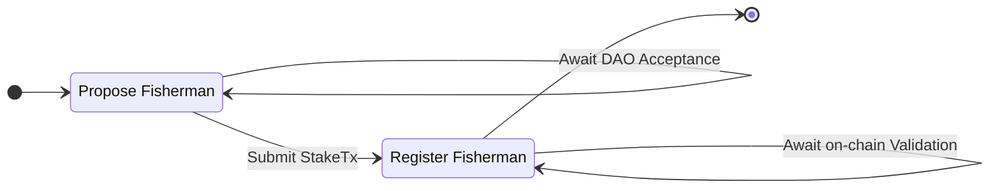

#### 3.3.2 Staking

In addition to the Proof of Authority (PoA) process described above, Fisherman are also required to participate in a Proof of Stake (PoS) process by bonding (i.e. staking) a certain amount of POKT in escrow, on-chain, while they are providing the Fishermen services.

PoA and PoS are used to filter madmen adversaries who defy economic incentives in order to attack the network. Upon registration, a Fishermen must provide the necessary information to interact with the protocol, as illustrated in the interface below.

```go
type FishermanStakeMsg interface {
  GetPublicKey()  PublicKey  # The public cryptographic id of the Fisherman custodial account
  GetStakeAmount() BigInt    # The amount of uPOKT in escrow (i.e. a security deposit)
  GetServiceURL() ServiceURL # The API endpoint where the Fishermen service is provided
  GetGeoZone() []GeoZone     # The physical geo-locations identifiers this Fisherman is registered in
}
```

#### 3.3.3 Sampling Protocol

The Sampling Protocol is required to grade how each Servicer adheres to the network SLA criteria defined in the [Servicer Protocol](#32-servicer-protocol). Registered Fishermen are responsible for monitoring and periodically sampling Servicers during active Sessions.

`NumSamplesPerSession`, a governance parameter, defines how many samples a Fisherman is required to make to each Servicer during the duration of a sessions. To ensure a fair assessment across all Servicers in the session, the same request must be sent to all the Servicers at the same time during the time of evaluation. The frequency at which the samples are sent, as long as the `NumSamplesPerSession` quota is satisfied, should aim to be evenly distributed throughout the session. The performance of the Servicer will smooth out to the expected value over time through [The Law of Large Numbers](https://en.wikipedia.org/wiki/Law_of_large_numbers).

The data collected is:

1. **Availability**: Null sample if the Servicer is down or unresponsive
2. **Latency**: Round-Trip-Time (RTT) in milliseconds
3. **Data Consistency**: The accuracy of the data through Honest Majority consensus

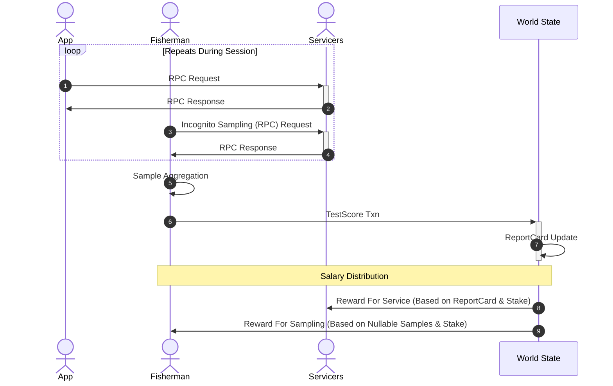

#### 3.3.4 Incognito Sampling

Servicers may bias to prioritizing responses to requests from Fisherman in order to achieve a higher score. [Ring Signatures](https://en.wikipedia.org/wiki/Ring_signature) will be used in order to prevent identifying who signed the request: Fisherman, Application or Gateway.

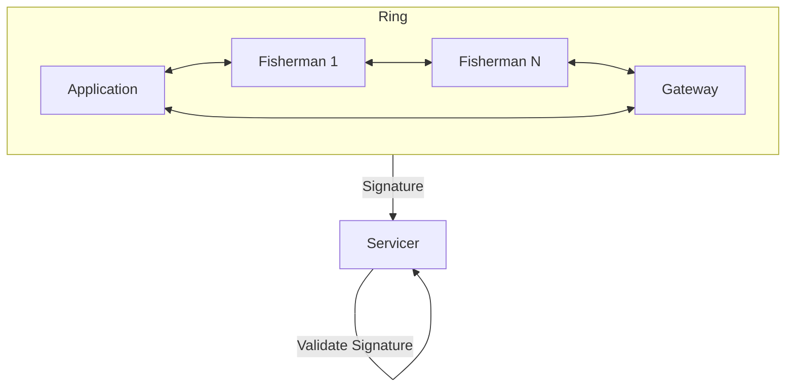

Fishermen are also expected to obfuscate their IP through IP address rotation, VPNs, Tor networks or other mixers to prevent being easily identified over prolonged periods of time.

#### 3.3.5 Salary Distribution

Fisherman salaries are dependant on the quantity and completeness of the `TestScoreMsg`s they send, but are agnostic to their contents with regard to the Servicer's Quality of Service.

**Report completeness** is based on the number of Nullable samples that have a value collected by the Fisherman. `NumSamplesPerSession` are expected to be performed by each Fisherman on each Servicer throughout a session.

Similar to the salary distribution algorithm described in the [Servicer Protocol](#32-servicer-protocol), Fisherman salaries are proportional to the estimated Application volume usage. However, Fishermen salary distribution is only based on the TestScoreMsg quantity and its consistence (i.e. # of non Null samples), as opposed to the actual test scores of the samples.

During each session, the Fisherman is expected to make `NumSamplesPerSession` of each active Servicer. The time at which they are made should be normally distributed throughout a session with some variance to avoid predictability. Servicers will timestamp and sign the requests to avoid forgery by the Fishermen.

If a Servicer does not respond, the sample is marked as a Null. Since Fisherman salaries are based off of Nullable samples with a value, they are incentivized to exhaust sampling attempts to retrieve the Servicer's score, up to a maximum of `NumSamplesPerSession`.

If a Servicer exceeds `MaxNullableSamples` in a single Session, the Fishermen will opt to submit a PauseMsg of the unavailable Servicer, enabling the protocol to introduce a new Servicer into the Session with the following block. The PauseMsg action is limited up to `MaxFishermenPauses` per Session to prevent faulty Fishermen behavior. Individual Fishermen salaries are then calculated through a combination of Application volume usage in a certain `(RelayChain, GeoZone)` pair as well as the quantity of non-Null samples.

The following graph summarized some of the high-level interactions described above.

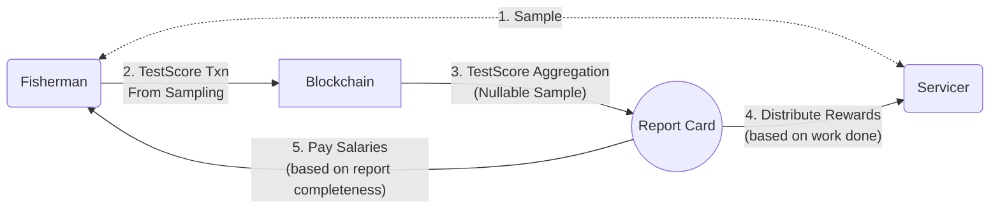

#### 3.3.6 Test Score Submission

On-chain test score submission follows an optimistic **Commit & Reveal** methodology to avoid excessive chain state bloat while maintaining sampling security. It is similar to the [Claim & Proof lifecycle](https://github.com/pokt-network/pocket-core/blob/staging/doc/specs/reward_protocol.md) designed in Pocket Network

Fisherman `TestScoreMsg`s have a `TestScoreSubmissionProbability` requirement of being submitted, and `TestScoreProofProbability` requirement of needing to be proven. In practice, this means that while all Sessions are monitored, and all samples are made, only some are submitted on-chain, and a subset of those are formally proven. Similar to Session generation, this selection is done under the [Random Oracle](https://en.wikipedia.org/wiki/Random_oracle), so the Fishermen cannot predict which TestScores will be sampled, which need to be committed, and which need to be proven on-chain. Deterministic but non-predictable on-chain parameters (e.g. FutureBlockHash) will be used to seed the selection.

Test Score Submission

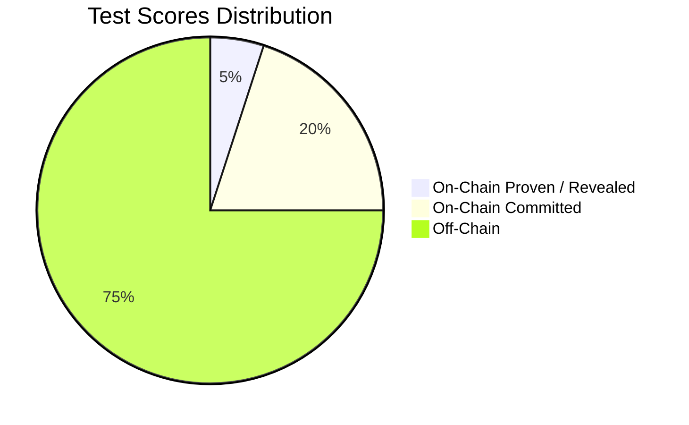

Furthermore, due to alignment of Fisherman incentives and desired brevity of on-chain Proof data, ProofTxs only require the Fisherman to prove they executed the sampling by verifying a single Non-Null sample. The specific sample required to prove the TestScore is determined by the ‘claimed’ TestScoreMsg and the BlockHash after ProofTestScoreDelay blocks elapse and is required to be submitted before MaxProofMsgDelay. This reveal mechanism allows for an unpredictable assignment of the required sample but is deterministic once the BlockHash is finalized. Using the timing requirement of the sampling strategy, the protocol can easily verify the sample index when submitted in the ProofMsg. It is important to note, that all Web3 requests and responses are signed by the requester (Fisherman or Application) and the responder (Servicer). This cryptographic mechanism ensures the integrity of a timestamp, as without the signature from the particular Servicer PrivateKey, a Fisherman would be able to falsify the timestamp. Though a successful ProofMsg has no effect on the reward of any Fishermen, an unsuccessful ProofMsg burn is severe to make up for the probabilistic nature of the proof requirement.

See


```go
type TestScoreMsg interface {
  GetSessionHeader() SessionHeader # The Session Header (Height, AppPubKey, GeoZone, RelayChain, etc..)
  GetFirstSampleTime() Timestamp   # First sample timestamp
  GetNumberOfSamples() uint8       # Total number of samples collected (max of `NumSamplesPerSession`)
  GetNullIndices() []int8          # Indices of null samples
}

type TestScoreProof interface {
  GetSessionHeader() SessionHeader # The Session Header (Height, AppPubKey, GeoZone, RelayChain, etc..)
  GetProofLeaf() Timestamp         # Actual sample containing the proper timestamp
}
```

#### 3.3.7 Parameter Updates

A Fisherman can update any of the values in its on-chain attributes by submitting another `FishermenStakeMsg` while it is already staked. Parameter changes must be permissioned through the DAO ACL and the `StakeAmount` must be equal to or greater than its current value.

```go
type FishermenStakeMsg interface {
  GetPublicKey()  PublicKey     # The public cryptographic ID of the Fisherman
  GetStakeAmount() BigInt       # May be modified to a value greater or equal to the current value
  GetServiceURL() ServiceURL    # May be modified
  GetGeoZone() []GeoZone        # May be modified
}
```

#### 3.3.8 Fisherman Pause

A Fisherman can submit a `PauseMsg` to gracefully, and temporarily, remove themselves from service (e.g. for maintenance reasons).

Since Fishermen are DAO permissioned, a minimum of `MinActiveFisherman` must be registered and active at any point in time for a Fisherman to be able to pause or unstake. Downtime or inability to meet the DAO defined SLA may result in burning of the Fisherman's stake.

Similar to how Fishermen can send a `PauseMsg` on behalf of faulty Servicers, the DAO will also be able to pause faulty or malicious Fishermen as defined in Pocket Network's Constitution.

A Fisherman can submit an `UnpauseMsg` after `MinPauseTime` has elapsed to resume monitoring services.

#### 3.3.9 Unstaking

Similar to unpausing, a Fisherman can permanently remove themselves from service and `MinActiveFisherman` are still active and registered. The stake will only be returned after `FishermenUnstakingTime` has elapsed and permissioned through the DAO to permanently end its services.

#### 3.3.10 DAO Monitoring

Enforcement of Fishermen behaviour and quality is an off-chain endeavor, undertaken by the DAO and crowd-sourced through the _Good Citizens Protocol_ of each protocol actor or community member. DAO monitoring consists of public Fishermen audits, statistical analysis, and incognito network actors that police interactions of Fishermen. The details, conditions, and limitations of DAO monitoring are defined further in the 1.0 Constitution.

In practice, the _Good Citizens Protocol_ act as sanity checks for the network actors, developers, users and community to monitor the Fishermen. It is an opt-in, configurable module, that checks individual interactions against resulting finality data and automatically reports suspicious, faulty, or malicious behavior of the Fishermen to off-chain data sites which are analyzed and filtered up to the DAO and to the public. Individual Fishermen burns and Good Citizen bounties are determined by the DAO and defined in the 1.0 Constitution.

### 3.4 Application Protocol

Applications are a category of actors who consume Web3 access from Pocket Network Servicers. Effectively, Applications are the ‘demand’ end of the Utilitarian Economy, who purchase access in the native cryptographic token, POKT, to use the decentralized service. In order to participate as a Application in Pocket Network, each actor is required to bond a certain amount of tokens in escrow while they are consuming the Web3 access. Upon registration, the Application is required to provide the network information necessary to create applicable Sessions including the GeoZone, the RelayChain(s), the bond amount, and the number of Servicers per Session limited by the MinimumServicersPerSession and MaximumServicersPerSession parameters. It is important to note, the bond amount of Applications is directly proportional to the MaxRelaysPerSession which rate-limits Application usage per Servicer per Session. In Pocket 1.0, Relay cost is discounted the higher amount an Application stakes to incentivize consolidation up to MaximumApplicationStakeAmount. This registration message is formally known as the StakeMsg and is represented below in pseudocode:

#### 3.4.1 Staking

```go
type ApplicationStakeMsg interface {
  GetPublicKey()  PublicKey     # The public cryptographic id of the Application
  GetStakeAmount() BigInt       # The amount of uPOKT in escrow (i.e. a security deposit)
  GetRelayChains() []RelayChain # The flavor(s) of Web3 hosted by this Application
  GetGeoZone() GeoZone          # The physical geo-location identifier this Servicer registered in
  GetNumServicers() int8        # The number of Servicers requested per session
}
```

Once successfully staked and a new SessionBlock is created, an Application is officially registered and may consume Web3 access from Servicers that are assigned through the Session Protocol in the form of a request/response cycle known as a Relay. In order for an Application to get Session information, i.e. their assigned Fisherman and Servicers, they may query a public Dispatch endpoint of any full node. To ensure Pocket Network SLA backed service, the Application executes a handshake with the assigned Fishermen. The Application provides the Fisherman with a temporary and limited Application Authentication Token and a matching Ephemeral Private Key that is used by the Fisherman to sample the service of the Session in real time. Once the Application handshake is executed, the Application may use up to MaxRelaysPerSession/NumberOfServicers per Servicer during a Session. If the Application maxes out the usage of all of its Servicers, it is unable to Relay any further until the Session elapses.

#### 3.4.2 Parameter Updates

An Application is able to modify their initial staking values including GeoZone, RelayChain(s), NumServicers, and StakeAmount by submitting a StakeMsg while already staked. It is important to note, a StakeAmount is only able to be modified greater than or equal to the current value. This allows the protocol to not have to track pieces of stake from any Application and enables an overall simpler implementation.

```go
type ApplicationStakeMsg interface {
  GetPublicKey()  PublicKey     # identity of edited Servicer
  GetStakeAmount() BigInt       # must be greater than or equal to the current value
  GetRelayChains() []RelayChain # may be modified
  GetGeoZone() GeoZone          # may be modified
  GetNumServicers() int8        # may be modified
}
```

#### 3.4.3 Unstaking

An Application is able to submit an UnstakeMsg to exit the network and remove themself from the network. After a successful UnstakeMsg, the Application is no longer eligible to consume Web3 traffic from Servicers. After ApplicationUnstakingTime elapses, any Stake amount left is returned to the custodial account.

```go
type ApplicationUnstake interface {
  GetAddress()  Address       # The address of the Application unstaking
}
```

#### 3.4.4 Stake Burning

Application Stake burn is a necessary mechanism to ensure an equilibratory economy at network maturity. Given the timeline for network maturity is approximated to be a decade from the time of publication, this document does not detail a non-inflationary economic scenario. In the inflationary phase of Pocket Network, Application Stake burn rate is able to be controlled through the AppBurnPerSession parameter which is expected to be set near zero. In practice, though the burn value is expected to be negligible, Application stake is able to be burned over a function of time. As described above, MaxRelaysPerSession is generated by the StakeAmount of the Application and the Application burn will affect this value as the StakeAmount changes.

### 3.5 Gateway Protocol

A `Gateway` is a permissionless protocol actor to whom the Application can **optionally** delegate on-chain trust in order to perform off-chain operations.

Pocket Network's Utilitarian Economy incentivizes data redundancy in a multi-chain ecosystem, with cheap, accessible and highly available multi-chain access. Depending on the level of trust, or lack thereof, an Application can optionally use a Gateway for various operations such as session dispatching or request signing.

_Note that an Applications that requires just-in-time guarantees and full integrity of the data it is processing should maintain its own infrastructure and validate every piece of state before signing state changes dependant on them. This could come in the form of maintaining full nodes, synching light clients & validating proofs (if available by the Web3 resource), and running its own ETL pipelines (e.g. data indexing)._

#### 3.5.1 OAuth

[OAuth](https://oauth.net) is an open (Web2) protocol that authorizes clients or 3rd parties to gain access to restricted resources. It can be summarized via following flow:

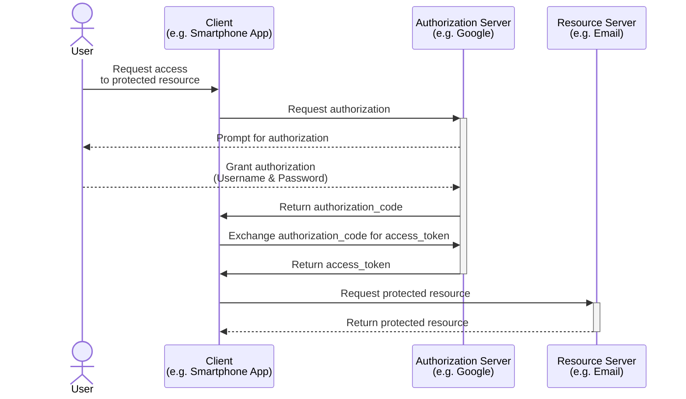

Some parallels can be drawn between existing centralized, trusted and permissioned systems relative to Pocket's Utilitarian Economy:

- The `Client` remains as the `Client`
- The `Application` is the `User`
- The `Application` is a one-time `Authorization Server`
- The `Gateways` is an ongoing `Authorization Server`
- The `Servicer` is the `Resource Servicer`
- The `Fisherman` is a separate monitoring party overlooking the `Resource Servicer` most often owned by the `Authorization Server`

#### 3.5.2 Application w/o Gateway

An Application that chooses to operate without a Gateway is responsible for dispatching sessions and signing RPC requests on its own. To do so, it will need to maintain a Pocket Full Node or a Pocket Light Client.

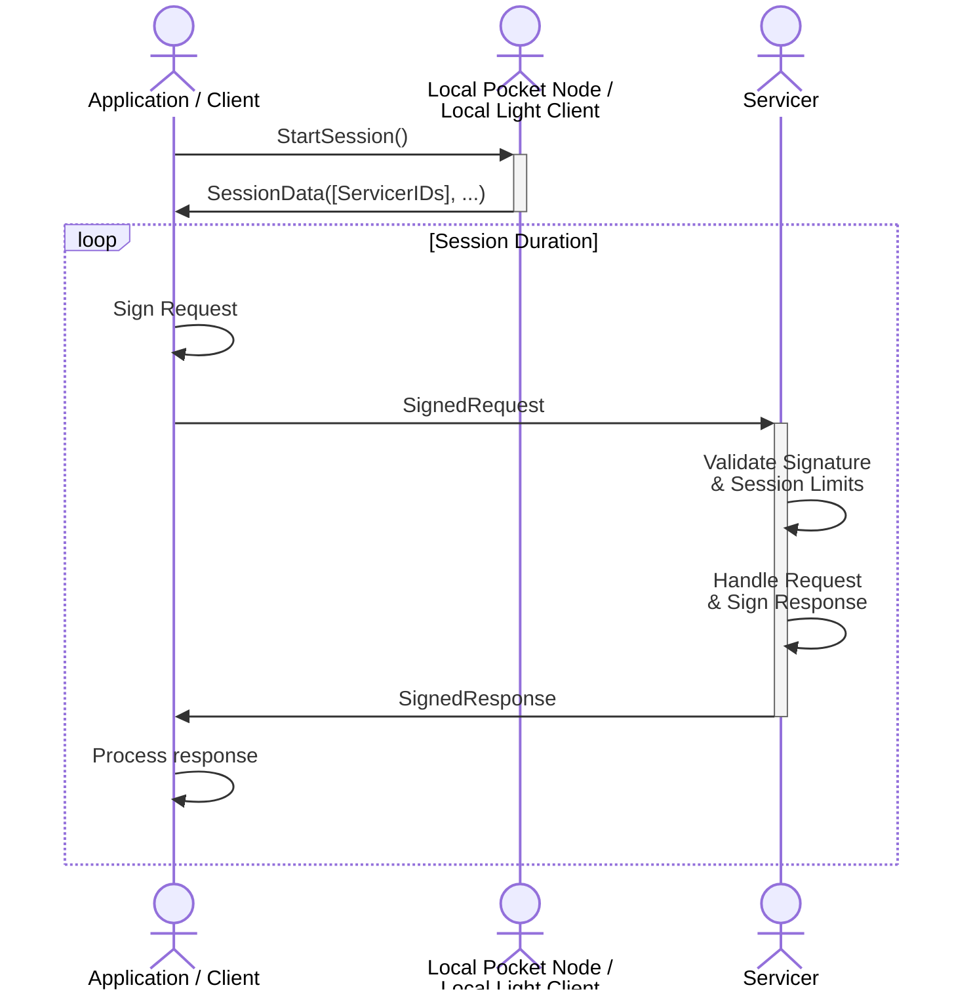

#### 3.5.2 Application Delegation

An Application that chooses to delegate trust to a Gateway will need to submit a one-time `DelegateMsg` transaction to delegate trust from the Application to the Gateway. It must include the PublicKey of the Gateway and be signed by the Application.

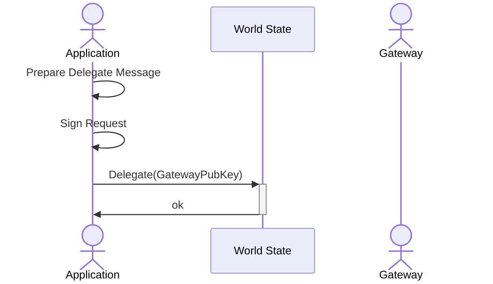

#### 3.5.3 Application Servicing

When an Application chooses to start a new session, the Gateway is responsible for dispatching the on-chain StartSession request and use an off-chain mechanism (e.g. AccessTokens) to service the Application. Throughout the duration of the session, validation and communication between the Application and Gateway are done using off-chain mechanisms.

Similar to to the [incognito sampling section of the Fisherman Protocol](#334-incognito-sampling) section, Ring Signatures will be used by the Servicer to validate the signed request. As long the the request is done by the staked Application, or the delegated to Gateway, the Servicer is incentivized to process and be rewarded for the request.

Applications may continue making permissionless requests to the servicer, in parallel with the Gateway, as the signature is agnostic to the Servicer. The session tokens used for rate limiting by the Servicer will come out of the same bucket as described in the [rate limiting algorithm](#315-rate-limiting).

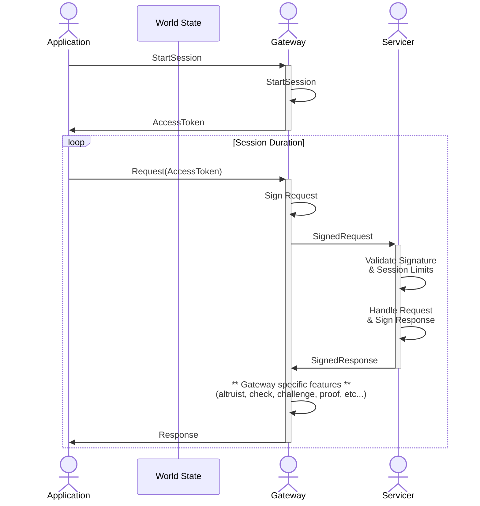

#### 3.5.4 Off-Chain Benefits

As shown in the section above, delegation enables free market off-chain economics where additional features, guarantees or payments can be made. For example, this includes but is not limited to a contractual agreement between Applications and Gateways to execute [Client Side Validation](https://forum.pokt.network/t/client-side-validation/148) with every Nth request.

#### 3.5.5 Registration

Registration differs from staking in the sense that the pubKey is known but there are no economic benefits/penalties in this stage of the protocol's progression.

The Gateway must register on-chain in order for the Servicer to accept its signature as part of the ring. Future versions of the protocol may include on-chain rewards or penalties for the Gateway, but the current iteration will incentivize Gateways to provide a high quality, highly trusted service through free market economics.

When staking, the Gateway must bond a certain amount of POKT to be able to participate in the network. The governance parameter, `StakePerAppDelegation` limits the number of Applications that can delegate to it, and it is the Gateway's responsibility to increase its stake as the number of Applications that trust it grow.

For example, if `StakePerAppDelegation` is 100 POKT and the Gateway has staked 1000 POKT, a transaction by the 11th Application to delegate to it will be rejected until the stake is increased appropriately.

```go
type GatewayStakeMsg interface {
  GetPublicKey()  PublicKey       # The public cryptographic id of the Gateway account
  GetStakeAmount() BigInt         # The amount of uPOKT in escrow (i.e. a security deposit)
  GetServiceURL() ServiceURL      # The API endpoint where the Gateway service is provided
}
```

### 3.6 Validator Protocol

A `Validator` is a protocol actor whose responsibility it is to achieve securely validate and process transactions. It does so through Byzantine Fault Tolerant consensus. See the accompanying [Consensus Specification](../consensus/README.md) for full details on its internals.

#### 3.6.1 Validator Registration

Validators registration is permissionless. In order to participate in the network as a Validator, the `ValidatorStakeMsg` must be se

Validators are a category of actor whose responsibility is to securely process transactions and blocks using the Pocket Network 1.0 Consensus Protocol. Though most of their functional behavior is described in the external 1.0 Consensus Protocol specification and the Transaction Protocol section, a state specific Validator Protocol is needed to allow a dynamic Validator set and provide the necessary incentive layer for their operations. In order to participate in the network as a Validator, each actor is required to bond a certain amount of tokens in escrow while they are providing the Validator services. These tokens are used as collateral to disincentivize byzantine behavior. Upon registration, a Validator must inform the network of how many tokens they are staking and the public endpoint where the Validator API is securely exposed. In addition to the required information, an optional OperatorPublicKey may be provided for non-custodial operation of the Validator. This registration message is formally known as the StakeMsg and is represented below in pseudocode:

```go
type ValidatorStakeMsg interface {
  GetPublicKey()  PublicKey       # The public cryptographic id of the custodial account
  GetStakeAmount() BigInt         # The amount of uPOKT in escrow (i.e. a security deposit)
  GetServiceURL() ServiceURL      # The API endpoint where the validator service is provided
  GetOperatorPubKey() PublicKey   # OPTIONAL; The non-custodial pubKey operating this node
}
```

Pocket Network 1.0 adopts a traditional Validator reward process such that only the Block Producer for each height is rewarded proportional to the total Transaction Fees + RelayRewards held in the produced block. Though the Block Producer selection mechanism is described in greater detail in the external Consensus Specification document, it is important to understand that the percentage of stake relative to the total stake is directly proportional to the likelihood of being the block producer. The net BlockProducerReward is derived from the TotalBlockReward by simply subtracting the DAOBlockReward amount. Once a proposal block is finalized into the blockchain, the BlockProducerReward amount of tokens is sent to the custodial account.

```go
func CalculateBlockReward(TotalTxFees, DAOCutPercent) (blockProducerReward, daoBlockReward) {
  # calculate the DAO's cut of the block reward
  daoBlockReward = perfectMult(TotalTxFees, DAOCutPercent)
  # calculate the block producer reward
  blockProducerReward = TotalTxFees - daoBlockReward
  return
}
```

In Pocket 1.0 Validators are able to use a PauseMsg to gracefully remove them from Validator operations. This feature allows for greater UX for Operators, enabling scheduled periods of maintenance or damage control in faulty situations. In addition to an Operator initiated PauseMsg, Validators are removed from service automatically by the network if byzantine behaviors are detected. Not signing blocks, signing against the majority, not producing blocks, and double signing blocks are byzantine behaviors reported to the Utility Module by the Consensus Module through the Evidence Mechanism. Anytime an automatic removal of service occurs for Validators, a burn proportional to the violation is applied against the Validator stake. The conditions, limitations, and severity of the Byzantine Valdiator burns are proposed and voted on by the DAO. If a Validator is ‘paused’, they are able to reverse the paused state by submitting an UnpauseMsg after the MinPauseTime has elapsed. After a successful UnpauseMsg, the Validator is once again eligible to execute Validator operations.

```go
type ValidatorPauseMsg interface {
  GetAddress()  Address       # The address of the Validator being paused
}

type ValidatorUnpauseMsg interface {
  GetAddress()  Address       # The address of the Validator being unpaused
}
```

A Validator is able to modify their initial staking values including the ServiceURL, OperatorPubKey, and StakeAmount by submitting a StakeMsg while already staked. It is important to note, that a StakeAmount is only able to be modified greater than or equal to the current value. This allows the protocol to not have to track pieces of stake from any Validator and enables an overall simpler implementation.

```go
type ValidatorStakeMsg interface {
  GetPublicKey()  PublicKey       # which Validator stake data is being edited?
  GetStakeAmount() BigInt         # must be greater than or equal to the current value
  GetServiceURL() ServiceURL      # may be modified
  GetOperatorPubKey() PublicKey   # may be modified
}
```

A Validator is able to submit an UnstakeMsg to exit the network and remove itself from Validator Operations. After a successful UnstakeMsg, the Validator is no longer eligible to participate in the Consensus protocol. After ValidatorUnstakingTime elapses, any Stake amount left is returned to the custodial account. If a Validator stake amount ever falls below the MinimumValidator stake, the protocol automatically executes an UnstakeMsg for that node, subjecting the Validator to the unstaking process.

```go
type ValidatorUnstake interface {
  GetAddress()  Address       # The address of the Validator unstaking
}
```

### 3.7 Account Protocol

An `Account` is a structure that maintains the ownership of POKT via a mapping from an `Address` to a `Balance`.
The summation of all balances of all accounts in the network equals the `TotalSupply`.

```go
type Account interface {
  GetAddress() Address # The cryptographic ID of the account
  GetBalance() Big.Int # The amount of uPOKT
}
```

#### 3.7.2 Send Transaction

The only state modification an Account may execute is a `SendMsg` of tokens from one account to another.

```go
type SendMsg interface {
  GetFromAddress() Address # Address of sender Account; the signer
  GetToAddress() Address # Address of receiver Account
  GetAmount() Big.Int # The number of uPOKT transferred
}
```

#### 3.7.3 Pool

A Pool is a special type of Account that is completely autonomous and owned by the network. POKT can be burnt, mint and transmitted to a Pool at the protocol layer at the time of state transition without explicit transactions. Pools can be used for tasks such as fee aggregation and distribution based on state machine changes.

```go
type Pool interface {
  GetAccount() Account # The cryptographic ID of the account
  GetName() string     # The name of the pool
}
```

The list of pools includes, but is not limited to, the `DAO`, `FeeCollector`, `AppStakePool`, `ValidatorStakePool`, `ServicerStakePool`.

### 3.8 State Change Protocol

There are two categories of state changes in Pocket Network 1.0 that may be included in a block: Transactions and Evidence. The third and final category of state changes in Pocket Network is autonomous operations that are completed based on the lifecycle of block execution orchestrated by the Consensus Module.

By far the most publicly familiar of the three categories of state changes are Transactions: discrete state change operations executed by actors. The structure of a Transaction includes a payload, a dynamic fee, a corresponding authenticator, and a random number Nonce. The payload of any Transactions is a command that is structured in the form of a Message. Examples of these Messages include StakeMsg, PauseMsg, and SendMsg which all have individual handler functions that are executed within the Pocket Network state machine. A digital signature and public key combination is required for proper authentication of the sender, the dedicated fee incentivizes a block producer to include the transaction into finality and deter spam attacks, and the Nonce is a replay protection mechanism that ensures safe transaction execution.

```go
# Transaction Interface
type Transaction interface {
  GetPublicKey()  PublicKey       # Identifier of sender account; Must be the signer
  GetSignature() Signature        # Digital signature of the transaction
  GetMsg() Message                # The payload of the transaction; Unstake, TestScore, etc.
  GetFee() Big.Int                # The number of Tokens used to incentivize the execution
  GetNonce() String               # Entropy used to prevent replay attacks; upper bounded
}
```

Evidence is a category of state change operation derived from byzantine consensus information. Evidence is similar to Transactions in creation, structure, and handling, but its production and affects are limited to Validators. Evidence is largely a protection mechanism against faulty or malicious consensus participants and will often result in the burning of Validator stake.

```go
type Evidence interface {
   GetMsg() Message                # Payload of the evidence; DoubleSign, timeoutCert, etc.
   GetHeight() Big.Int             # Height of the infraction
   GetAuth() Authenticator         # Authentication of evidence, can be Signature or Certif
}
```

Autonomous state change operations are performed by the protocol according to specific lifecycle triggers linked to consensus. Examples of these events are BeginBlock and EndBlock which occur at the beginning and ending of each height respectively. Rewarding the block producer, processing QuorumCertificates, and automatic unstaking are all illustrative instances of these autonomous state change commands.

### 3.9 Governance Protocol

Though most off-chain governance specification is included in the DAO 1.0 Constitution document, the Utility Module’s Governance Protocol defines how the DAO is able to interact with the on-chain protocol on a technical level.

#### 3.9.1 Parameter Updates

The Access Control List (ACL) is the primary mechanism that enables live parameter configuration. Specifically, the ACL maintains the "feature switches" that allow active modification of the behavior of the protocol without any forking. As the name suggests, the ACL also maintains the account(s) permissioned to modify said parameters. A value can be modified by a `ParamUpdateMsg` from the permissioned owner of that parameter.

```go
type ParamChangeMsg interface {
  GetAddress() Address  # Address of sender account; must be permissioned through ACL)
  GetParamName() String # The name of the parameter being updated
  GetValue() any        # The new value of the parameter being modified
}
```

#### 3.9.2 DAO Treasury

In addition to the ParamChange message, the DAO is able to burn or transfer from a specified DAO Module Account. In practice, this Module Account is used as the on-chain Treasury of the DAO, the limitations and specifics of which are maintained in the DAO 1.0 Constitution document.

```go
type DAOTreasuryMsg interface {
  GetSrcAddress() Address  # The sender of the funds; must be permissioned through ACL
  GetDstAddress() *Address # OPTIONAL; the receiver of the funds if applicable
  GetOperation() DAOOp     # The identifier of the operation; burn or send
  GetAmount() Big.Int      # The operation is executed on this amount of tokens
}
```

As the only permissioned actors in the network, Fishermen are subject to individual burns, pauses, or removals initiated by the DAO. Usages of this message type are a result of the off-chain monitoring mechanisms described in the Fisherman Protocol section of the document. The specifics and limitations of usage of this message type is detailed in the DAO 1.0 Constitution.

```go
type PolicingMsg interface {
  GetAddress() Address           # Address of sender account; Must be permissioned on ACL
  GetPoliced() Address           # Address of the policed actor
  Operation() DAOOp              # Identifier of the operation; burn, pause, remove
  GetAmount() Big.Int            # Amount of tokens (if applicable)
}
```

## 4. Sequence

In order to fully understand Pocket Network 1.0 and its place in the project's maturity, a rollout context is a prerequisite.

### 4.1 ProtoGateFish

During the testing and development of a v1 TestNet:

- The Fisherman & Gateway models will be will be prototyped and live-tested
- Major Servicer node runners of Pocket Network V0 may have the option to participate as Fisherman and/or Gateway actors

### 4.2 Castaway

Upon the initial launch of Pocket Network v1 MainNet:

- The DAO will need to approve a single PNI owned Fisherman
  - Other Gateways will have the option to register shortly after
  - PNI Gateway registration will be part of the genesis file
  - This guarantees at least one gateway on launch (no upper bound)
- PNI will need to operate the first live Gateway
- Pocket Network scalability issues will be resolve
- Permissionless Applications will be enabled
- The economy will enable Network participants to operate their own Gateways

### 4.2 Fishermen

- Fisherman governance parameters will be tuned
- Additional Fisherman will be approved by the DAO

### 4.3 CastNet

- A specification for fully permissionless fisherman is designed and developed

## 5. Attack Vectors

_NOTE: This section does not exhaust all attack vectors considered, rather details the ones that were deemed important._

### 5.1 Attack Category Types

#### 5.1.1 Profit Seeking Passive

**Primary goal**: Long term. Increase the total value of the attacker's assets.

**Secondary goals**: Avoiding detection and damage to personal or network reputation.

**AKA**: Don’t kill the goose that lays the golden eggs.

#### 5.1.2 Profit Seeking Active

Short term. Increase the total value of the attacker's assets and sell it before the network/DAO can notice and react.

**AKA**: Take the money and run.

#### 5.1.3 Collusion Passive

A single active attacker relies on tacit cooperation from a second party that benefits from not reporting the attack.

**AKA**: Don’t ask. Don’t tell.

#### 5.1.4 Collusion Active

Two active players in two different parts of the economic system seek to circumvent the system by actively submitting fraudulent information and/or blocking attempts to punish, penalize or burn the malfeasant actor(s).

**AKA**: The master plan.

#### 5.1.5 Target Network Isolation (DDoS)

Profit seeking attacks seek to reduce the effectiveness and/or number of competitors, thereby increasing the share of rewards received.

**AKA**: Kill the competition.

#### 5.1.6 Hacker

An attack which requires creation, modification and upkeep of the core software in a private repository w/ deep protocol expertise.

**AKA**: Mr. Robot

#### 5.1.7 Inflation, Deflation

An attack whose net effect is an increase or decrease in the rate of production of new tokens.

In most cases, these are likely to be **Mad Man Attacks** because any benefit/deficit created will be distributed throughout the entire network.

**AKA**: Make It Rain.

#### 5.1.8 Mad Man Attacks

Non-profit seeking seeking attacks/behaviors which cost more to perform than can reasonably be expected to benefit the attacker. Usually results in damage to the network's reputation.

**AKA**: Kill 'em all.

##### 5.1.8.1 Mad Man Lazy

Attack does not require significant time, energy or resources.

**AKA**: What happens when I push this button?

##### 5.1.8.2 Mad Man Hacker

Non-profit seeking attack which requires creation, modification and upkeep of the core software in a private repository.

##### 5.1.8.3 Masochistic Mad Man

Any attack which, although possible, makes no sense because you could accomplish the same thing without doing all that work.

**AKA**: Rube Goldberg Attack.

### 5.2 Attack Examples

#### 5.2.1 Fisherman <> Servicer Collusion

**Attack Vectors**: Profit seeking passive, Collusion active, Hacker

If a Fisherman is colluding with one or more Servicers and is in possession of the private key(s) of those nodes, he is able to falsify all aspects of that node’s report card. Therefore, all of his colluding node partners get A+ report cards and resultantly larger paychecks.

This is the “big one”. It is the primary reason that Fishermen are (at this stage) DAO Approval is required. It is why off chain data logs, good-citizen reporting and DAO oversight exist. It is also the reason that Fishermen require large stake/deposit, as well as increased destaking period and delayed payments (See attached spreadsheet of projected collusion ROI based on such factors as Node Percentage, Risk Rate, etc.)

The attack is easy to describe, but not easy to perform because a rather large body of work has gone into making sure that it is extremely difficult to perform, a very small payoff, and extremely costly to get caught.

#### 5.2.2 Fisherman attacking Servicers through TestScores (Collusion passive, Hacker, Mad Man Lazy, Inflation/Deflation)

If a Fisherman falsifies certain aspects of a node’s report card, he can lower that node’s proper payment share (direct attack) and increase the relative profit of all non-attacked nodes (indirect benefit if Fisherman is also a Servicer owner)

This attack is a lot of work with very little reward. The “excess” POKT does not get distributed to the non-attacked nodes. It gets burned. Therefore the benefit to non-attacked nodes is only a relative gain in terms of the overall network inflation rate. This is a highly detectable attack and the victims are highly motivated to report it. Bottom line here is: We’re talking about a highly motivated hacker, who is also Mad Man Lazy.

#### 5.2.3

**Fisherman false reporting Application volume metrics (Mad Man Lazy)**

There is no financial incentive for a Fisherman to report Application volume higher or lower than actual. Servicers are incentivised to check for under reporting. There is no specific disincentive for over reporting. Other than (of course) losing all of your stake and reputation.

#### 5.2.X

**Fisherman using AAT to get free Web3 access (Masochistic Mad Man)**

WOW.. a Lazy Mad Man with too much money and too much free time. Sorry, I can’t take this attack seriously. It’s like stealing a car so that you can plug in your phone and charge it up for free.

#### 5.2.X

**Fisherman DDOS (Mad Man)**

No one benefits by DDOSing a Fisherman. The relay, dispatch, service and blockchain processes are not dependent on Fishermen. The attack does not change node report cards. It only makes less forof them and less overall network inflation. The Fisherman loses money, but no one gets the excess.

#### 5.2.X

**Fisherman incognito identified (Lazy Mad Man, Hacker)**

Fishermen act in “incognito” fashion purely as a deterrent to a particular theoretical publicity seeking attack called Mad Man Blogger. Neither honest, nor dishonest nodes gain any advantage by identifying a particular relay request as belonging to a Fisherman. You can only provide your best service, it’s not possible to provide “better” service to a Fisherman than you already provide. However, the Mad Man Blogger could (if he chose to and if he successfully identified all Fishermen) provide service to only Fishermen and not to applications. We consider this an edge case attack in which the attacker has made a significant investment in POKT and in backend node infrastructure solely for the purpose of “proving” that the system can be gamed. Therefore, the contract with the DAO which Fishermen agree to, requires periodic changing of IP address and reasonable efforts to keep it unknown by other actors in the ecosystem.

#### 5.2.X

**Fisherman or Servicer will register spam applications for selfish economic benefit (Inflation Attack, Mad Man Lazy)**

As to Fishermen spamming via owned app:

There is no economic benefit to Fishermen from this activity as their payment is independent of application usage. One could argue that the Fisherman will benefit from the increase in supply caused by spamming the network this way. However, any inflation attack which benefits the majority of the network to a greater degree than the person who pays for and performs the attack is non-profit seeking.

As to Servicer spamming via owned app:

This activity is an inflation attack which is not profitable to the attacker.

#### 5.2.X

**Actors intentionally staking in “wrong” geo-zone to gain some advantage/attack.**

It is economically advantageous for actors to stake within their true GeoZone as Session actor pairings are generated specifically for the GeoZone registered. Specifically, Applications will receive worse QOS and worse fidelity of Fishermen QOS monitoring by proxy as the Servicers are farther away but still within the same GeoZone as the Fishermen. Servicers are the same way, as once a GeoZone is mature the Servicers in other GeoZones are no longer competitive.

## 6. Dissenting Opinions (FAQ)

<!-- TODO(olshansky): Review & Update -->

**Public facing Fisherman is a vulnerability for censorship and defeats the purpose of decentralized infra.**

Public facing Fishermen are no more subject to censorship than the DAO is. Just like the DAO voters, the more Fishermen participating in the network, the safer the mechanism they control is. The true difference between the DAO voters and Fishermen is the Fishermen’s scope of control is limited only to the quality of service enforcement and the DAO’s control spans the entirety of the system. If the DAO were to ever be compromised by an adversary, the Validators are able to fork the chain and install a new governing body through a social consensus of the ACL. In a parallel situation, if the Fishermen were ever compromised, the DAO would be able to modify the actors without forking the chain and halting service. The architectural separation of powers between Validators, Servicers, Fishermen, and the DAO is what truly ensures the safety of Pocket Network.

**Quality of Service is a second order metric thus it is not a good criteria for salaries of Servicers.**

Quality of Service is harder to measure than Quantity of Service, but it is not a second order metric. Total value of anything is measured as: (How Much X How Pure) minus the cost of making it pure.

**The DAO is not a silver bullet, it’s not trustless, it’s a potential attack vector.**

A powerful government might be able to temporarily stop quality of service metrics but the chain continues. There's no realism in thinking that an overtaking of the DAO isn't a catastrophic event for any version of Pocket Network. As long as there are params like 'MaxValidators' or 'RewardForRelays' the DAO may stop Pocket Network until a social fork happens. Fishermen are the same way. Stop the Fishermen, the DAO will instill new ones. Stop the DAO, the Validators will add a new DAO.

**Publicly identifying fishermen puts them at risk of attacks in the real world.**

Sure, this is a concern that all people in public office deal with.

**Fishermen are not truly Applications, rather a proxy, so the accuracy of their TestScores is questionable and not a valid criteria for salaries of Servicers.**

From a Servicer’s perspective, Fishermen are indistinguishable from applications and therefore are not only valid criteria, but - in fact - preferable sources of information because they are financially incentivised to collect honest and complete reports. Experience with V0 has shown that although applications have the ability to enforce some aspects of Servicer quality, they do not avail themselves of this opportunity.

**The requirements of Fishermen actors are too high. The incentives are oriented properly so POA/POS is overkill.**

If the requirements are too high, the DAO can choose to lower them. Better to start high and lower the bar than to start low and risk flooding the initial system with actors who have little to lose.

**The off-chain monitoring of Fishermen is not secure enough for the duties they are responsible for.**

Off-chain data monitoring and reporting for some aspects of Fishermen activities serves three purposes:

1. It reduces blockchain bloat which is one of the key goals of V1 and an absolute necessity if Pocket network is to grow successfully.
2. It provides a method by which “mad man” actors and Fisherman/Servicer collusion can be detected and punished.
3. Very importantly, it creates a testable, modifiable, tunable environment where large portions of the action and incentive system can be studied without risk of chain state errors. This tested and tuned incentive system is considered a prerequisite for the eventual codification of the system and translation into a fully self-enforced, decentralized solution (Phase II, AKA CastNet)

Keep in mind that good actors by definition do not need to be incentivized to maintain the rules of the system. +2/3 of the network is assumed to want the network to run. Examples of this is how there's no incentive for Validators to propagate Byzantine Evidence in Tendermint and no incentive for Validators to destroy their ephemeral private keys in Algorand's BA. Or even in Hotstuff, there's no incentive for Validators to uphold the integrity of their 'LockedQC' values.

In this case, the people monitoring the Fishermen are the DAO who's largely invested in Network security and integrity and the other network actors who are interacting with the fishermen and are highly incentivized to keep them in-check, like Apps and Servicers. Apps rely on fishermen to enforce the network's decentralized Service Level Agreement. Servicers rely on fishermen to accurately shape their report cards against their peers.

Vitalik on Social Coordination argument:

_'This security assumption, the idea of “getting a block hash from a friend”, may seem unrigorous to many; Bitcoin developers often make the point that if the solution to long-range attacks is some alternative deciding mechanism X, then the security of the blockchain ultimately depends on X, and so the algorithm is in reality no more secure than using X directly - implying that most X, including our social-consensus-driven approach, are insecure._

_However, this logic ignores why consensus algorithms exist in the first place. Consensus is a social process, and human beings are fairly good at engaging in consensus on our own without any help from algorithms; perhaps the best example is the Rai stones, where a tribe in Yap essentially maintained a blockchain recording changes to the ownership of stones (used as a Bitcoin-like zero-intrinsic-value asset) as part of its collective memory. The reason why consensus algorithms are needed is, quite simply, because humans do not have infinite computational power, and prefer to rely on software agents to maintain consensus for us. Software agents are very smart, in the sense that they can maintain consensus on extremely large states with extremely complex rulesets with perfect precision, but they are also very ignorant, in the sense that they have very little social information, and the challenge of consensus algorithms is that of creating an algorithm that requires as little input of social information as possible.'_

**Applications handshaking with Fishermen is more burdensome than V0’s requirements for Applications.**

The only additional requirement of V1 for Applications is to provide the Fisherman a limited AAT/Key combination. V1 also removes the difficult decision of Applications configuring for Quality or Throughput. V1 comes with QOS out of the box so the burden of challenging Servicers is completely eliminated.

**Applications granting an AAT to a Fishermen is completely insecure as they are providing the Fishermen access to their authenticator.**

The Fisherman receives a one-time, one-session token which allows the Fisherman to do only one thing: request relays. The Fishermen have no incentive to overuse that ability. Even a mad-man Fisherman is limited in its ability to cause harm if it wished to.

**By ‘unburdening’ Applications from monitoring QOS you have effectively removed their ability to challenge their servicers. This is a downgrade from V0.**

Applications are and will remain free to report bad service. Unfortunately, even with automated assistance and easy to use SDKs, it is deemed highly likely that applications will continue to act in the future as they have in the past. IE: They don’t spend time and energy fixing our product for us. They just walk away. Self-monitored and Self-enforced QOS is seen as the most viable path forward.

**Only requiring Fishermen to prove they executed the (availability) sampling and not produce on-chain evidence of their data accuracy, latency, and volume claims is an exploitable vulnerability which Fishermen can/will take advantage of.**

Each and every metric which is sampled is collected and verifiable on the off-chain systems. Storing that data on- chain is one of the current V0 problems that V1 seeks to solve. As to the exploitability of this particular aspect… (see.. Madman and Collusion in the attack vectors section) the incentive structure of V1 Fisherman rewards is such that there is no economic gain from this activity and the potential loss is quite significant.

**The optimistic submission of TestScore and Proof transactions degrade the overall security and quality of the network.**

Optimistic Submission:

We imagine that an argument could be put together which tries to demonstrate a security reduction because of optimistic submission. However, since the only aspect of security which is being affected is the amount of payment that Servicers receive, the argument would have to restrict itself to only that single aspect of V1 and (in our opinion, at this time) we do not see such an argument as being valid. However, we look forward to review and discussion of any such argument if and when someone presents it.

**The approximation of MaxRelays through hash collisions is probabilistic and will always have inaccuracies. Thus, it is an unfit method to determine Application usage and TotalAvailableReward inflation.**

Although the first statement (probabilistic=inaccurate) is true, the conclusion (=unfit) does not follow from the premise. V0 is currently probabilistic in selection of Servicers as well as quantity of relays per session. As they apply to node payments, V1 removes the probabilistic components of both node selection and quantity of relays, and replaces them with an amalgamated pool from which they are then distributed in a transparent and protocol enforced manner.

We do see (and are working to mitigate) potential “bad luck” sessions where an application might receive less than an appropriate minimum relay amount. This is not seen as a hard problem to overcome. “Good Luck” sessions will also happen on occasion. This is not seen as a problem at all.

**The name of the actor ‘Fishermen’ has other meanings for other projects and should be changed.**

Traditionally, Fishermen are monitoring actors in other Web3 projects. They allow minimum on-chain information by providing off-chain double-checks on the participants who make ‘claims’. Similar to Validators, though our flavor of Fishermen is different and unique, the core functionality of the actor remains the same.

**Ability of Fishermen to replace servicers mid session makes it necessary that the size of the dispatch list for any given session cannot be fixed.** (Open question)

Newly “recruited” nodes need the freedom to respond to application requests even though they are outside of the calculated list for that session. We may be able to limit dispatch list growth to 2 X the computed size however since the Fisherman cannot replace more than the entire original list. This opens a door for applications to double their effective dispatch list but does not allow abuse of relay usage.

**Memos might be important (open question)**

If people want to keep memos (which are helpful in the case of traceability/auditability), a compromise between the full content of the memos and nothing might be the signature of the text that “would be” on the memo using the private key. Of course, this begs the question of how big is too big, and what’s the average and mean sizes for memos in our current chain.

## 7. Future Research & Candidate Features

<!-- TODO(olshansky): Review & Update -->

1 ) The existence of non-custodial node operations (scheduled for V0.7) may open the possibility for on-chain delegation of stake for node running. It may or may not prove easier to accomplish this goal by securitized lending of tokens via Wrapped POKT. Further investigation is needed.

2.a) Modifying the formula(s) around how MaxRelaysPerSession is calculated such that applications can receive some benefit or credit for unused access. This is already envisioned to some degree by the non-inflationary stage of the network evolution.

2.b) Allowing application excess usage to be paid for by stake reduction. Also something that is envisioned to be needed when the network reaches the non-inflationary stage. But perhaps needed sooner.

2.c) Optimistic Payments (in addition to Optimistic Rewards): Rather than the protocol strictly enforcing rate limits, which requires the protocol to track relays, we treat the app as innocent until proven guilty. We assume that the app will adhere to the allowance they’ve staked for, we don’t strictly enforce rate limits in the protocol, then we burn the app’s stake if other actors (e.g. fishermen) can prove they lied. Due to the session structure, just as we monitor servicers, we could also monitor apps. And if we’re monitoring the volume of work that apps request, these volume proofs can be the input to determining inflation. This model has the added benefit of enabling more flexibility in how apps use their allowance. If an app has spiky traffic (e.g. GoodDollar), they can exceed their permitted throughput temporarily along as they average out within their long-term rate limits.

3 ) Possibility of somehow “overlapping” geo-zones such that a service node with very good latency/performance might be included in nearby zones if it is capable of providing service at an acceptable level.

4 ) Feasibility of “loosening” the parameters around application staking such that an application may access multiple relayChains with a single ATT using a % allocation or aggregation among relayChain usage.

1. Harberger Tax on Servicer Selection: What if apps could choose the nodes they want to receive service from? If multiple apps choose a node, the node gets re-assigned to the highest-staked app (Harberger Tax style), and the losing app gets nodes subbed in according to QoS, where highest-TestScore nodes are priority-assigned to the highest-staked apps. This way we have an on-chain continuous auction mechanism for maximizing the value captured of an app’s willingness-to-pay for high quality service. This also feeds into my other suggestions about not having staking requirements for “trial period” Servicers, because it is another mechanism that ensures the highest-staked apps don’t have quality degraded by trial Servicers.

X ) CastNet: AKA Phase 2

The initial and final goal of V1 was and is: “To build what we would have built from the beginning if we had the time, resources and experience needed”. V0 has been a long, hard and extremely successful balancing act. The distance between V0 and the final goal is simply too large to safely traverse in a single revision. There are too many unknown and unproven steps. Nonetheless, the goal remains in sight and the path to its achievement is visible.

At this time we have two possible versions of CastNet which pass initial logical review, and it’s expected that the final version will contain elements of both.

Candidate #1: The Evolution path

V1 brings off chain data verification checks via time stamped and tamper proof log files, which are checked by Servicers who forward potentially actionable enfractions to the DAO for review and action if needed. The evolution path envisions condensing and hashing those logs and reports into a verifiable “side chain” and automating the review and action process to something that happens without a DAO vote. Although (at least at first) DAO override ability is expected.

- Pro: Step by Step logical conversion of existing processes
- Pro: Little or no overhead to main-chain.
- Pro: Easy to revert to prior step(s) if needed.
- Con: Kinda “Old School Hacky”
- Con: Leaves an echo, or skeleton of the fisherman behind, but no KYC or oversight needed.

Candidate #2: The Byzantine Revolution

This path sees the direct conversion of Fishermen functionality into a multi member quorum of deterministic non-predictable validator nodes. Log checks and review are not needed in this model, however some degree of logging will likely exist during development and early deployment as a sanity check. In this model the reward for quorum verification process is based on degree of consensus overlap with the other quorum members.

- Pro: Modern On-chain solution
- Pro: Logically verifiable both on paper and on chain.
- Con: Increase in on-chain data, and transactions (How much? That’s the 64 POKT question)
- Con: Single step, consensus breaking change
- Con: Greater complexity of design.

## References

1. [Pocket Network V0 Whitepaper](https://pocket-network-assets.s3-us-west-2.amazonaws.com/pdfs/Pocket-Network-Whitepaper-v0.3.0.pdf)
2. [Pocket Network Forum](https://forum.pokt.network/)
3. [Pocket Network Constitution](https://github.com/pokt-foundation/governance/blob/master/constitution/constitution.md)
4. [Pocket Network V0 Implementation](https://github.com/pokt-network/pocket-core)
5. [Pocket Network V1 Implementation](https://github.com/pokt-network/pocket)
6. [Tendermint](https://tendermint.com/)
7. [Cosmos](https://v1.cosmos.network/sdk)
8. [Uber's H3](https://h3geo.org)
9. [PostGIS](https://postgis.net/)
10. [Token Bucket Algorithm](https://en.wikipedia.org/wiki/Token_bucket)
11. [Bitcoin](https://en.bitcoin.it/wiki/Difficulty)
12. [Ring Signatures](https://en.wikipedia.org/wiki/Ring_signature)
13. [OAuth](https://oauth.net)
