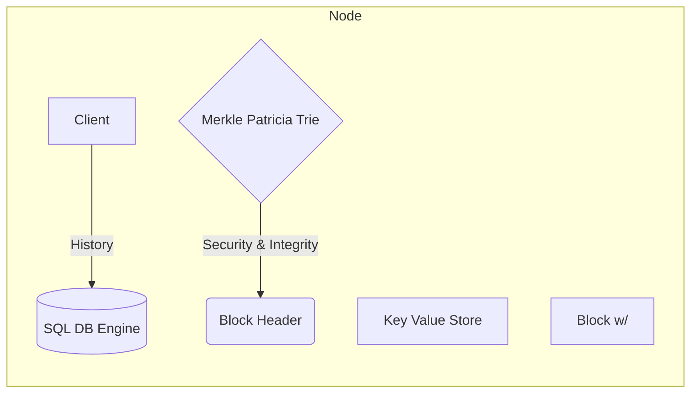
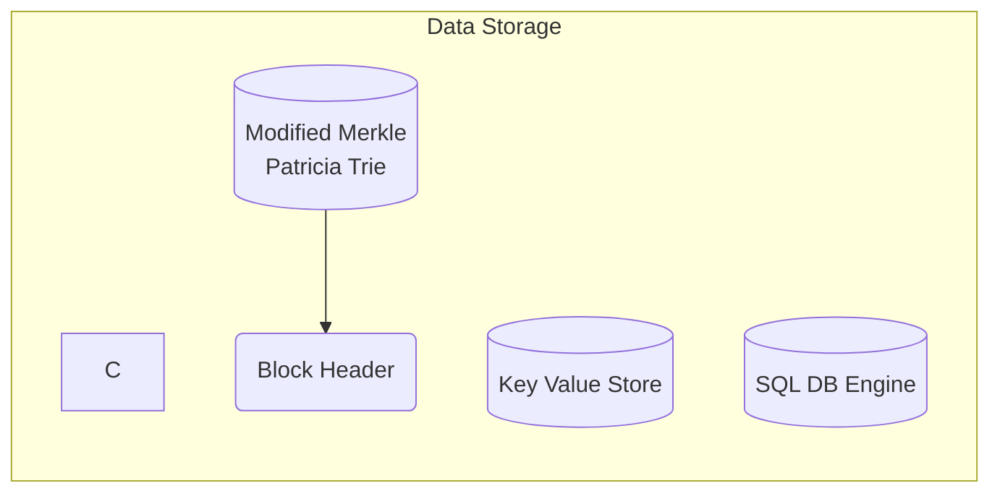
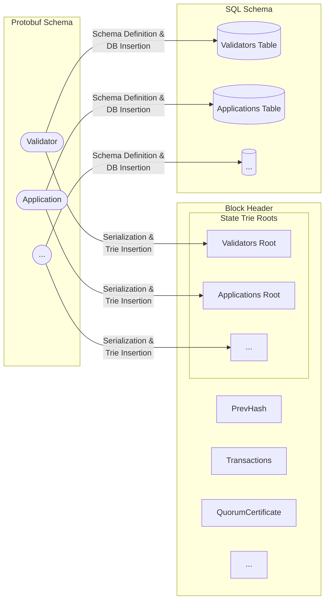
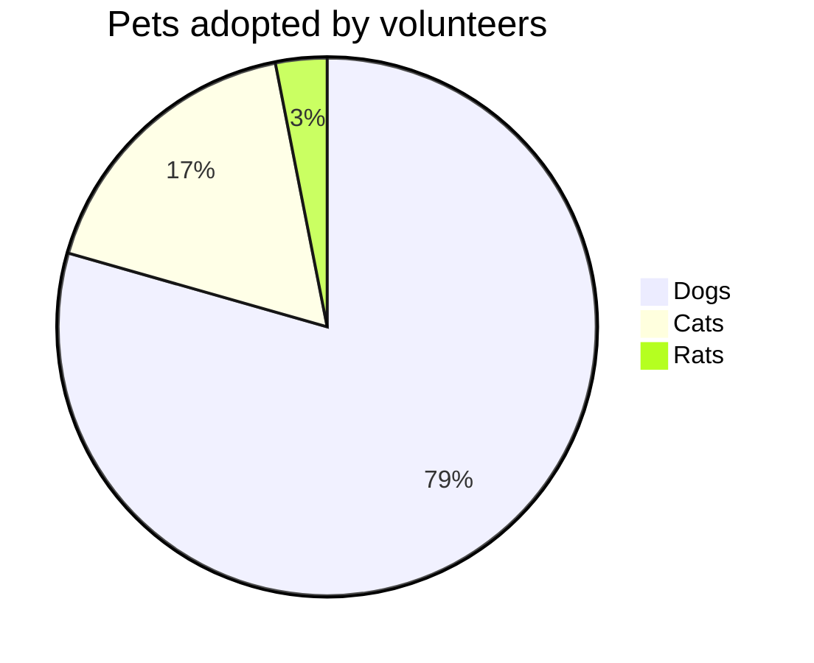
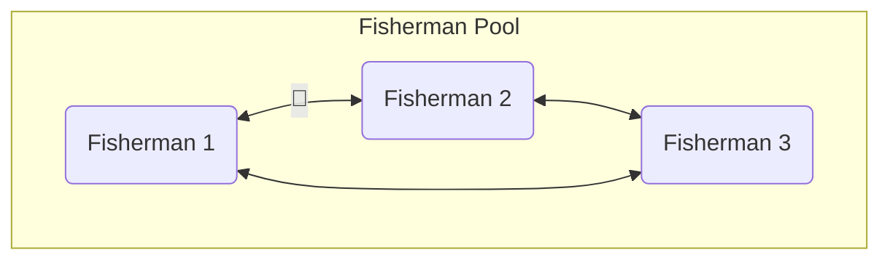

%% Not including all actors (fisherman, applications, servicers, fisherman)











```
flowchart LR
    subgraph FP["Fisherman Pool (Chain, GeoZone)"]
        F1("Fisherman 1\n📝💯")
        F2("Fisherman 2\n📝💯")
        F3("Fisherman 3\n📝💯")
        F1 <-- "👀" --> F2
        F2 <-- "👀" --> F3
        F1 <-- "👀" --> F3
    end

    subgraph SP["Servicer Pool (Chain, GeoZone)"]
        SN1("Service Node 1\n📝💯")
        SN2("Service Node 2\n📝💯")
        SN3("Service Node 3\n📝💯")
    end

    subgraph VP["Validator Pool"]
        V1("Validator 1")
        V2("Validator 2")
        V3("Validator 3")
        V1 <-- "👀" --> V2
        V2 <-- "👀" --> V3
        V1 <-- "👀" --> V3
    end

    subgraph OP["Other Pools"]
        DAO["👀 DAO Pool 👀"]
        FEE["Fee Pool"]
        APP["App Pool\n(Chain, Geozone)"]
    end

    VP --> OP
    VP --> FP
    VP --> SP
    FP --> SP

```
